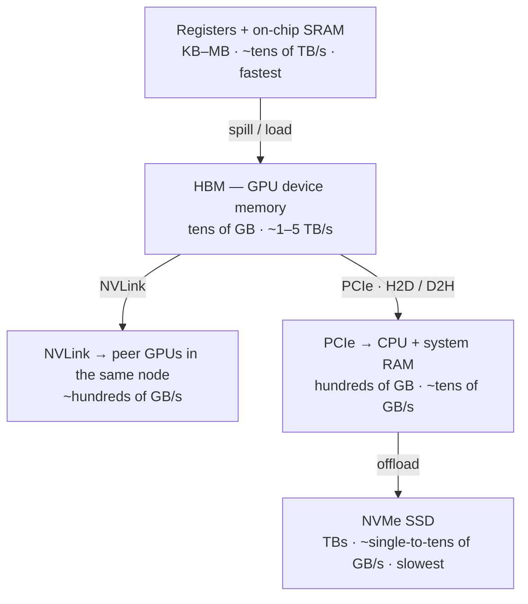
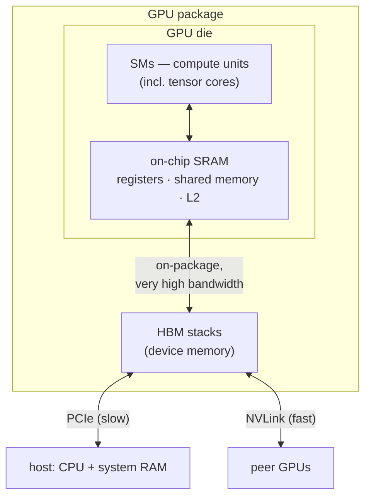

# Chapter 0.5 — The hardware underneath

## TL;DR

The whole course rests on one fact about hardware: **memory is a ladder, and every rung down trades bandwidth for capacity.** Registers and on-chip **SRAM** are tiny and blindingly fast; **HBM** — the GPU's own device memory — holds your weights and KV cache and is fast but finite; **NVLink** joins GPUs inside one box; **PCIe** is the comparatively slow bus out to **CPU RAM**; **NVMe** is the slow, enormous floor. Almost every serving decision in this course is the same move — *figure out which rung you're crossing, and avoid the slow one.* Why decode is memory-bound (Ch.01), why FlashAttention tiles in SRAM (Ch.07), why tensor parallelism stays inside a node (Ch.10), why swapping KV to the CPU hurts (Ch.11), why long context spills to NVMe (Ch.14, Ch.21) — all the same picture. This chapter draws the ladder once so the rest of the course can point at it. **Read it if HBM / SRAM / NVLink / PCIe aren't already second nature; skip it if they are.**

---

## Why this matters

You cannot reason about an inference bill from the FLOPs alone. A GPU rated at hundreds of teraflops will sit two-thirds idle during decode — not because it ran out of math, but because it ran out of **memory bandwidth** to feed the math. Every "why is it slow?" in serving eventually bottoms out in a data-movement question: *which memory did that byte come from, how fast is that path, and could we have avoided the trip?* Get the ladder in your head now and every later trade-off — quantization, paging, batching, parallelism, offload — reads as a move on the same board. Skip it and those chapters feel like a bag of unrelated tricks instead of one idea applied over and over.

---

## The concept

### The one picture the rest of the course never draws

Here is the memory hierarchy a serving stack lives on, fastest and smallest at the top, slowest and largest at the bottom:

*(The GB/s figures are illustrative ~2026 ballparks to show the **ratios**, not truth to memorize — ask your agent for your exact GPU. The **ordering** is the durable part.)*

Each rung down buys roughly 10× the capacity for a few× to ~10× less bandwidth. That single trade — more room, slower access — is the tension the entire course negotiates.

### The GPU is compute units plus two kinds of memory

Zoom into the accelerator itself:

The **SMs** (streaming multiprocessors) are the compute — thousands of cores plus **tensor cores**, the units that do the dense matrix multiplies a transformer is mostly made of. They read and write two very different memories: a small pool of **on-chip SRAM** (registers, shared memory, caches — sitting *on the die*, next to the compute) and the large **HBM** off to the side. Everything about kernel performance is managing the traffic between those two.

### HBM: where your weights and KV cache actually live

**HBM** (High-Bandwidth Memory) is the number on the spec sheet — "80 GB," "141 GB." It holds the model weights, the KV cache (Ch.04), activations, everything. It is fast in absolute terms (~1–5 TB/s) but it is the constraint in two ways at once: **capacity** (your weights + KV must fit, Ch.04/Ch.09/Ch.10) and **bandwidth** (decode must stream every weight *from* HBM to make each token — the reason decode is memory-bound, Ch.01). When you hear "the model doesn't fit" or "we hit the KV wall," HBM is what filled up.

### SRAM: tiny, absurdly fast, and why kernels fight over it

**SRAM** is the on-die memory — measured in **KB to MB per SM**, but with bandwidth roughly an order of magnitude above HBM because it never leaves the chip. It is too small to hold a layer, let alone a model. The art of a fast kernel is doing as much work as possible on the sliver of data currently in SRAM before paying to move the next sliver in from HBM. That is *exactly* the FlashAttention trick (Ch.07): keep the attention tile in SRAM, never write the giant score matrix out to HBM. Hold this contrast — MB of blistering SRAM vs. GB of merely-fast HBM — and Ch.07 needs no setup.

### The roofline, in one paragraph

Two numbers decide whether an operation is limited by math or by memory: how many **FLOPs** it does, and how many **bytes** it moves from HBM. Their ratio is **arithmetic intensity** (FLOPs per byte). Below a hardware-specific threshold (the "ridge point") you are **memory-bound** — starved for bytes, compute idle; above it you are **compute-bound** — the math is the limit. This is the roofline model, and it is the single most useful lens in the course. Its punchline, derived properly in Ch.01: **prefill is compute-bound, decode is memory-bound**, because decode moves the entire weight matrix from HBM to produce just one token. Most of this course is tactics for a memory-bound problem.

### NVLink vs PCIe: the two buses that decide multi-GPU

Two GPUs can talk two ways, and the difference is night and day:

- **NVLink** — a fast, direct GPU-to-GPU link *inside a node* (~hundreds of GB/s). Fast enough that the GPUs can act almost like one.
- **PCIe** — the general-purpose bus to the host and, on machines without NVLink, between cards (~tens of GB/s). An order of magnitude slower.

This one ratio is why **tensor parallelism lives inside a node** (Ch.10): TP does an all-reduce on the critical path of *every layer*, so it needs NVLink; run it across PCIe or Ethernet and the communication swamps the compute. "TP within a node, pipeline/replicas across nodes" is a direct consequence of the NVLink-vs-PCIe gap.

### Crossing to the host: PCIe, and why the GPU should never wait on the CPU

The CPU and its system RAM sit across the **PCIe** bus from the GPU. Two consequences run through the production chapters:

- **Data has to cross PCIe to get on and off the GPU** — host-to-device (H2D) and device-to-host (D2H) copies. This is why serving stacks keep tokenization, JSON parsing, and detokenization in a *separate process* off the GPU's critical path (Ch.15): CPU work and PCIe copies must overlap with compute, never stall it. (Using **pinned** host memory makes those copies meaningfully faster — a detail your agent can wire up.)
- **Spilling GPU state to the host is expensive.** When the scheduler preempts a request by **swapping** its KV out to CPU RAM (Ch.11), the cost *is* PCIe bandwidth, both ways. That's your exact CPU↔GPU-over-PCIe intuition, and it's why swap competes with plain recomputation as a preemption strategy.

### Below HBM: CPU RAM and NVMe as the overflow tiers

When HBM can't hold everything, the ladder keeps going down. **CPU RAM** (hundreds of GB, reached over PCIe) and **NVMe** SSD (terabytes, slower still) become overflow storage for the *cold* parts of the KV cache. Long context (Ch.14) and frontier serving (Ch.21) lean on this: hot KV on the GPU, warm KV in CPU RAM, cold KV on NVMe — paging blocks up and down the hierarchy as sequences and prefix caches outgrow HBM. It is the same virtual-memory idea as paged attention (Ch.06), stretched across the whole ladder.

### The mental model: "which tier am I crossing, and can I avoid it?"

Every optimization in this course is one of three moves on the ladder:

1. **Move less data** — quantization (Ch.09) shrinks the bytes per weight; GQA and FP8 KV (Ch.04/09) shrink the KV; prefix caching (Ch.12) skips recomputing bytes you already have.
2. **Move it across a faster rung** — keep attention in SRAM (Ch.07); keep TP on NVLink (Ch.10); keep CPU work off the PCIe critical path (Ch.15).
3. **Move it fewer times** — batching (Ch.05) amortizes one weight read from HBM across many requests; speculative decoding (Ch.08) gets more tokens per weight read.

If you can name which rung a technique is optimizing, you understand *why* it exists. That question — **which tier, how fast, can I avoid the trip** — is the thread. Keep pulling it.

### What the numbers are — and why this chapter won't pin them

Notice what's missing above: exact bandwidths, GPU model names, PCIe generations, prices. That's deliberate, and it's the course's whole design (Ch.00). The **ordering** of the ladder is durable and worth memorizing; the **absolute GB/s** rot with every hardware generation and differ across your A100, H100, consumer card, or whatever ships next. Those you get *live* — from your agent, or better, from a script that measures your actual hardware. The "Pair with your agent" prompts below do exactly that.

---

## Real-system notes

This chapter isn't grounded in the reference engines' source (the hardware is upstream of both) — instead, here is where each rung of the ladder gets *used* later, so you can read the primer as a table of contents for the memory story:

- **SRAM ↔ HBM** — Ch.01 (roofline), Ch.07 (FlashAttention tiles in SRAM).
- **HBM capacity + bandwidth** — Ch.04 (KV cache sizing), Ch.05 (the KV wall), Ch.09 (quantization to fit and to feed), Ch.10 (sharding weights + KV across GPUs).
- **NVLink** — Ch.10 (tensor parallelism must stay on it).
- **PCIe / host** — Ch.11 (KV swap costs PCIe both ways), Ch.15 (process split keeps the CPU off the GPU's critical path).
- **CPU RAM + NVMe** — Ch.14 (long-context KV offload), Ch.21 (KV tiering across the hierarchy at fleet scale).
- **Real hardware** — the concrete devices (data-center GPUs, their HBM sizes and bandwidths, NVLink/NVSwitch topologies, PCIe generations) change yearly. Ask your agent for the current lineup and the numbers for *your* GPU before you size anything; never quote a bandwidth from memory.

---

## Common failure cases

*These failures are durable; their fixes evolve fastest — each names the pattern and leaves current specifics to you and your AI partner.*

- **Sizing by FLOPs, not bandwidth.** Picking a GPU or batch size from teraflops when decode is memory-bound leaves compute idle and mispredicts throughput. *Fix: reason from HBM bandwidth for decode, FLOPs for prefill — the roofline (this chapter, Ch.01).*
- **Tensor parallelism across a slow link.** Running TP over PCIe or Ethernet makes N GPUs slower than one, because the per-layer all-reduce swamps the compute. *Fix: TP within an NVLink node; cross node boundaries with pipeline parallelism or replicas (Ch.10).*
- **Ignoring the host-transfer cost.** Treating H2D/D2H copies and CPU-side work as free stalls the GPU every step. *Fix: overlap CPU work and PCIe copies with compute; keep them off the critical path; use pinned memory (Ch.15).*
- **Treating offload as free capacity.** Spilling KV to CPU RAM or NVMe adds memory, but fetching it back costs bandwidth and latency on the hot path. *Fix: offload only cold KV; measure the fetch cost against recompute (Ch.11, Ch.21).*
- **Comparing accelerators by peak TFLOPS alone.** Two GPUs with similar FLOPs but different HBM bandwidth serve very differently at decode. *Fix: compare memory bandwidth and capacity too — often they decide the serving story (this chapter, Ch.17).*

---

## Pair with your agent

- *"Write the smallest script that measures my GPU's real HBM bandwidth (a big device-to-device copy) and compare it to the spec-sheet number. Explain the gap."*
- *"Measure host-to-device (PCIe) bandwidth for a large tensor, pageable vs. pinned memory. Show me the difference and explain why pinned is faster."*
- *"Compute the roofline ridge point for my GPU from its peak FLOPs and HBM bandwidth. Then tell me, for a 7B model in bf16, whether prefill and decode land above or below it."*
- *"If I have two GPUs, measure NVLink vs. PCIe bandwidth between them and show me why tensor parallelism wants the fast one."*
- *"Draw the memory hierarchy for my specific machine with the real numbers filled in — registers/SRAM, HBM, NVLink, PCIe, CPU RAM, NVMe — so I have the ladder for my hardware."*

---

## What's next

You now have the board every later chapter plays on: a ladder of memories, ordered by bandwidth, and one question — *which tier am I crossing, and can I avoid it?* Ch.01 puts the first piece on that board: **one forward pass**, where you'll derive the roofline for real and watch decode come out memory-bound. From here on, every mechanism is a move to keep the bytes on a faster rung, move fewer of them, or move them fewer times.
