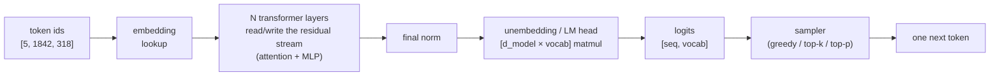
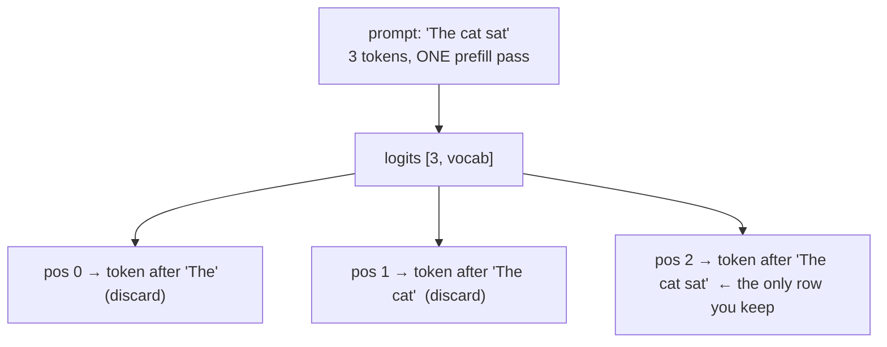

# Chapter 01 — One forward pass

## TL;DR

A single forward pass is the atomic unit of every LLM serving system. Token ids go in; the model runs one pass through its layers, reading every weight exactly once; a vector of **logits** comes out — one raw score per vocabulary entry, at every input position. A sampler turns the last position's logits into exactly one next token. That is the whole atom: the model proposes a distribution and stops; your runtime disposes. This chapter gets that pass exactly right, derives what it costs from a roofline model (the reason decode is memory-bound and batching works), and grounds the logits→token step in the real vLLM and SGLang samplers. Everything else in the course is a transformation of this one pass.

---

## Why this matters

"How much does one token cost?" is not a billing question — it is an architecture question, and its answer lives entirely in the forward pass. To emit one token during generation, the GPU must stream **every weight** of the model out of memory. Not because of the math — the math is cheap — but because of the memory traffic. That single fact, *one decode step reads all the weights*, is the seed of the KV cache, continuous batching, quantization, speculative decoding, and paged memory. Miss it and every later chapter is a bag of tricks; hold it and they are all the same trick applied to the same bottleneck.

A forward pass does not "reason." It maps a sequence of token ids to a probability distribution over the next token. The model publishes the distribution; **your** code selects from it. Once that split is precise in your head — model proposes, runtime disposes — sampling, batching, and speculative decoding stop being separate features and become obvious variations on where and how you run this pass.

---

## The concept

### The model emits a distribution; your runtime disposes

A weather forecaster does not decide tomorrow's weather; they publish `70% rain, 20% cloud, 10% sun`. Someone else decides whether to pack an umbrella.

A language model is the forecaster. Given the tokens so far, one forward pass publishes a probability distribution over the **entire vocabulary** for the next position — tens to hundreds of thousands of numbers. The model chooses nothing. Your **sampler** does: take the argmax (greedy), or draw from the distribution under temperature / top-k / top-p. This boundary is not a metaphor — it is a specific function in a specific file in every serving engine, and we will read two of them below.

When output is wrong, this split is the first cut of the diagnosis: did the model publish a bad distribution (a model/prompt problem), or did the sampler pick badly from a fine one (a decoding-config problem)? Different failures, different owners, different fixes.

### The four stages of a forward pass



1. **Embed.** Each token id indexes an embedding table and becomes a vector of width `d_model`. The sequence is now a tensor of shape `[seq_len, d_model]` — the **residual stream**.
2. **Layers.** N identical transformer blocks each *read from and write back to* that residual stream. Inside a block, **attention is the only operation that moves information across positions**; the MLP transforms each position independently. Almost all FLOPs and almost all the weight bytes live here.
3. **Norm + unembed.** A final normalization, then the LM head — an `[d_model × vocab]` matmul — projects each position back out to vocabulary size.
4. **Logits.** Output shape `[seq_len, vocab_size]`: for every input position, a raw score for every possible next token.

Two details the toy mental model omits and production forces you to track: the residual stream flows in the model's **compute dtype** (usually bf16/fp16), and the logits inherit it — which is why the logits→token *decision* is done in fp32, not the compute dtype (low-precision ties and rounding change which token wins). Where an engine puts that promotion differs — vLLM does it inside its sampler, below; SGLang handles precision upstream of the sampler — so don't expect the same line in both. And the shape is `[seq, vocab]`, not `[vocab]` — the pass predicts at *every* position at once, which is the next point.

### Prefill: the whole prompt in one pass

Feed a prompt of P tokens and the model processes **all P positions in a single pass**, in parallel, returning logits at every position. This first pass is **prefill**. But you keep exactly one row — the last position — because that is the only one predicting a token you don't already have. Position 3's logits predict "what follows the first 3 prompt tokens," which is a fact you were handed, not a generation.



The causal mask is what makes this legal: position *i* attends only to positions ≤ *i*, so computing all positions in one pass gives the same result as computing them one at a time. Prefill exploits that to do P positions' work at full GPU utilization. Production goes one step past "keep one row": it doesn't even *compute* the discarded rows through the LM head — the `[d_model × vocab]` projection runs only at the position(s) you need (an explicit `logits_indices`), because that head is itself ~1–2 GB of weights for a large vocab and a real slice of prefill cost. "Keep one row" is the toy version; "compute one row" is the production one. **Decode** — every pass after the first — does the opposite: one position, one token, the GPU mostly idle. The next section derives *why* that asymmetry exists, because the entire course is built on it.

### What one pass costs — the roofline

Two numbers govern a forward pass: FLOPs (arithmetic) and bytes moved (memory traffic). For a dense model of N parameters at `d` bytes per parameter:

- **FLOPs per token ≈ 2N** — one multiply and one add per parameter.
- **Weight bytes read ≈ N · d** — every weight streamed from HBM at least once.

Their ratio is **arithmetic intensity**, `I = FLOPs / bytes`:

```
decode (1 token):   I ≈ 2N / (N·d) = 2/d  flops/byte
                    bf16 (d=2) → I ≈ 1     fp8 (d=1) → I ≈ 2
```

Now compare to the GPU's **ridge point** — its peak-FLOPs ÷ peak-bandwidth, the intensity at which compute and memory are balanced. For a modern datacenter GPU that ridge is on the order of a few hundred flops/byte. Decode's intensity (~1) sits *far* below it, so decode is deeply **memory-bound**: wall-clock is set by `N·d / bandwidth`, not by FLOPs. A rented chip's memory bandwidth, not its FLOPs, is your decode ceiling — which is why quantization (shrinking `d`, Ch.09) often buys more tokens/sec than a faster core would. Plug your own model size and your GPU's real bandwidth into `N·d / bandwidth` with your agent to get a batch-1 ceiling; treat the *formula* as durable and the numbers as yours to measure.

Prefill flips the ratio. With P tokens in one pass, FLOPs ≈ `2N·P` while weight bytes stay ≈ `N·d` (each weight is reused across all P positions), so `I ≈ 2P/d`. Past a P of a few hundred, prefill crosses the ridge into **compute-bound**. And here is the load-bearing half-truth of serving: **batching B decode requests is like a prefill of width B — but only for the weight matmuls.** Each weight is read once and reused across all B tokens, so those ops' intensity climbs from ~1 toward the ridge and throughput rises. That is why batching works, and Ch.05 industrializes it.

What batching does *not* rescue is attention. The B tokens are B *independent* sequences, each attending to *its own* KV cache; that cache traffic scales with total context and **does not amortize across the batch** — every request re-reads its own cache each step. So batching lifts the weight term and promotes KV-cache reads to the new ceiling, which is exactly why decode stays memory-bound even at high batch, and why the KV cache (Ch.04), GQA/MQA (Ch.07), and paged memory (Ch.06) exist at all. *"Batching rescues decode"* is the beginner's version; *"batching rescues the weight term and exposes the KV term"* is the real one.

Two more places the clean roofline lies — deferred, but named now so you don't over-trust `N·d / bandwidth`. You rarely hit *peak* bandwidth; the achieved fraction is **MBU** (memory-bandwidth utilization), and a batch-1 decode is a skinny GEMV that can't fill the tensor cores — a *second*, independent reason batching helps, since it fattens the GEMV toward a GEMM. And `2N` / `N·d` are the **dense** case: a Mixture-of-Experts model does `≈ 2·N_active` FLOPs, and its batch economics *degrade* as tokens scatter to different experts (Ch.09, Ch.21). You are meant to leave this chapter able to *predict* that batching helps — and to know the one reason it eventually stops.

### Logits are scores, not probabilities — where the runtime disposes

The pass hands your runtime a `logits` tensor and halts. Everything after is code you control. Here is vLLM's, distilled to the load-bearing lines:

```python
# vLLM v1 Sampler — logits → token id.
# ref: references/vllm/vllm/v1/sample/sampler.py @ ae098ab  (Sampler.forward / .sample)

logits = logits.to(torch.float32)                    # L96  promote from bf16/fp16 BEFORE any decision
logits = self.apply_logits_processors(logits, meta)  # L98  allowed-ids, bad-words, penalties (mutate in place)

# --- sample() ---  three branches, chosen by what the batch needs:
greedy = None if meta.all_random else logits.argmax(dim=-1)  # L257 greedy SKIPPED for all-random batches
if meta.all_greedy:
    return greedy                                    # L261 pure-greedy batch → done, no temperature

temp = torch.where(temp < 1e-5, 1.0, temp)           # L236 apply_temperature (called L276): temp≈0 ⇒ greedy, no div-by-0
logits = logits.div_(temp.unsqueeze(1))              # L237 TEMPERATURE = divide logits before softmax
for proc in meta.logitsprocs.argmax_invariant:       # L282 min-p etc. (can't change an argmax)
    logits = proc.apply(logits)
random = self.topk_topp_sampler(logits, ...)         # L286 top-k / top-p, then draw from the distribution

if greedy is None:
    return random                                    # L293 pure-random batch → done, no torch.where
sampled = torch.where(temp < 1e-5, greedy, random)   # L296 MIXED batch: greedy rows vs sampled rows
```

Four things this real code teaches that `next_id = argmax(logits)` hides:

1. **fp32 promotion is load-bearing (L96).** Logits arrive in the compute dtype; vLLM up-casts to fp32 before argmax or softmax because low-precision ties and rounding change which token wins. This is the concrete root of the determinism failure below — not folklore, a line.
2. **Temperature is division of logits before softmax, and `temp=0` is a *branch* (L236–L237).** Zero is special-cased to greedy, not "divide by 0.0001." Anyone who thinks temperature 0 means a tiny divisor is refuted by the source.
3. **The decision is per-request, and the batch's composition picks the path (L256–L301).** A pure-greedy batch returns early; a pure-random batch skips greedy entirely; only a *mixed* batch computes both and selects each row with `torch.where`. One pass serves many requests with different sampling params, so "the decoding rule" is per-row, never global — a fact a single-request toy can never reveal, and a direct preview of batching (Ch.05).
4. **Order matters.** Penalties and masks (L98) hit the raw logits; temperature and top-k/top-p come *after*. Re-order these and you change the output distribution — a real, silent config bug.

### Two production samplers, one contract

Now SGLang, on the same job — read it as a diff against vLLM:

```python
# SGLang Sampler — same contract, different machinery.
# ref: references/sglang/python/sglang/srt/layers/sampler.py @ 52c6e27

logits = self._preprocess_logits(logits, info)       # L120 custom procs + sanitize_nan_logits(...)  (L91)
if info.is_all_greedy:
    next_ids = torch.argmax(logits, -1)              # L129 greedy = argmax — identical semantics to vLLM
else:
    # top-k/top-p dispatch to a fused FlashInfer kernel on CUDA (a torch backend exists too):
    from flashinfer.sampling import top_k_top_p_sampling_from_probs   # L30–33
    ...                                              # probs = softmax(logits / temperature); kernel samples
```

This is the course's central epistemic move, made concrete. **Where two independent production systems agree, the choice is load-bearing** — so it goes in the durable chapter body. Verified in *both* files: greedy is argmax, temperature scales logits before softmax, the decision is per-request across a batch, and logprobs are `log_softmax`. And here is a sharper version of the same lesson: a divergence you *assume* can dissolve under the source. It is tempting to say "vLLM uses torch kernels, SGLang uses FlashInfer" — but **both** default to the same fused **FlashInfer** top-k/top-p kernel on CUDA (vLLM via `TopKTopPSampler.forward_cuda`; SGLang via `top_k_top_p_sampling_from_probs`), each with a native-torch fallback for other backends. The kernel is an *agreement*, not a divergence — you only learn that by reading both, not one. **The real divergence is placement:** vLLM promotes to fp32 and applies penalties *inside* this sampler, while SGLang sanitizes non-finite logits here but pushes fp32 promotion and determinism handling *upstream*. That "where does the work live" difference is the kind of organizational choice that genuinely rots between releases — which is *why* the concept lives in prose and the snippet lives behind a commit SHA.

### The vocabulary is the contract

The logits vector has exactly one entry per vocabulary token; that width is fixed by the model, and the **tokenizer** is the contract mapping text ↔ ids on the way in and the chosen id → text on the way out. Pair the wrong tokenizer with a model and nothing throws — the pass runs on ids that mean something else and returns fluent, confident nonsense. So tokenizer and weights move as one unit, exactly like a function and its signature. Assert `logits.shape[-1] >= tokenizer.vocab_size` — not `==`: models pad the output dimension to a multiple of 64/128 (vLLM's `pad_vocab_size`) for tensor-core alignment, leaving real, usually-unused trailing logit slots. Ch.03 owns this contract in full (special tokens, chat templates, the text→token boundary).

### One pass is stateless — which is the whole problem

A forward pass remembers nothing. Generate token 1, and naively generating token 2 feeds the *entire* sequence back through every layer from scratch; token 3 reprocesses everything again. Work per step grows with sequence length and you re-derive identical intermediates every step — O(n²) over a completion. For one token, irrelevant. For a 2,000-token answer, ruinous. The KV cache (Ch.04) kills exactly this by saving each layer's key/value vectors so a new token processes only *itself* — turning per-step cost from "reprocess the prefix" into "attend to the cached prefix." But you cannot value the cache until you have felt the cost of the pass it caches. That is why this chapter is one pass, and the next two build the loop and the cache on top of it.

---

## Real-system notes

- **Hugging Face Transformers** is the clearest place to *see* the raw pass: calling the model returns `logits` of shape `[batch, seq, vocab]`; greedy decode is `argmax` over the last position. Its `generate()` wraps the loop, cache, and sampling you will build by hand over Ch.02–04 — read it *after* doing it manually, or the abstraction hides the mechanism.
- **vLLM** — `vllm/v1/sample/sampler.py` @ `ae098ab`. The `Sampler.sample` method is the canonical "model proposes, runtime disposes": fp32 promotion, then one of three branches — all-greedy, all-random, or a mixed batch selected per-row with `torch.where`. The forward pass itself is behind a model runner; the *sampler* is the part of Ch.01 that lives in real code.
- **SGLang** — `python/sglang/srt/layers/sampler.py` @ `52c6e27`. Same semantics as vLLM and — like vLLM — defaults to fused FlashInfer top-k/top-p on CUDA with a torch fallback; it differs in *placement* (NaN sanitization in the sampler; fp32/determinism upstream). The vLLM↔SGLang diff *is* the lesson: what looks like a divergence is often a shared choice, and the real differences are organizational.
- **llama.cpp** exposes the pass as `llama_decode` over a batch, writing logits into a buffer you read back and feed to sampler functions. It runs on a laptop CPU — the reference for *feeling* prefill vs. decode and the memory-bound ceiling without renting a GPU.

---

## Common failure cases

*These failures are durable; their fixes evolve fastest — each names the pattern and leaves current specifics to you and your AI partner.*

- **Reading the wrong logits row.** Prefill returns logits at every position; grab any but the true last one and you predict from the wrong context. *Fix: index the last *non-pad* position explicitly — with padded or ragged batches the answer is not `[-1]` (Ch.05).*
- **Sampling raw logits, or in the wrong dtype/order.** Logits are unnormalized bf16 scores; skipping fp32 promotion, softmax, or applying temperature after top-k silently distorts the distribution with no error. *Fix: enforce the order — fp32-promote → penalties/masks → temperature → top-k/top-p → sample — the sequence both real samplers follow (this chapter).*
- **Tokenizer/weights mismatch.** A pass with the wrong vocab produces fluent garbage and never raises. *Fix: pin tokenizer to weights; assert `logits width >= vocab_size` — equality fails on padded-vocab models (Ch.03).*
- **Non-finite logit rows.** An all-`-inf` or NaN row (bad mask, overflow, a fully-banned vocab) makes `argmax`/sampling return garbage or an out-of-range id. *Fix: sanitize non-finite logits before sampling — SGLang's `sanitize_nan_logits` is the pattern (this chapter).*
- **Assuming the pass is deterministic.** argmax ties, low-precision rounding, and non-deterministic GPU reductions make the *same* prompt yield different tokens across runs or batch sizes. *Fix: treat determinism as a property you test and engineer (fp32 promotion, deterministic modes), not one you assume (Ch.21).*

---

## Pair with your agent

- *"In HF Transformers, run one forward pass on a 5-token prompt of mine. Print the logits shape, argmax the last position, decode it, and explain why only the last row matters."*
- *"Open `references/vllm/vllm/v1/sample/sampler.py`. Walk me through `sample()` line by line and show me exactly where a per-request greedy-vs-sampled decision happens — then have me predict what changes if I move temperature after top-k."*
- *"Diff vLLM's sampler against `references/sglang/.../layers/sampler.py`. List what they agree on (load-bearing) vs. where they diverge (trade-offs) — and explain why FlashInfer-vs-torch *looks* like a divergence but is actually a shared default (both prefer the fused FlashInfer top-k/top-p kernel on CUDA); the real divergence is where fp32 promotion and NaN sanitization sit."*
- *"Derive the batch-1 decode ceiling for a 7B model in bf16 on my GPU from `N·d / bandwidth`. Then measure real tokens/sec and explain the gap — what am I not accounting for?"*
- *"Force an all-`-inf` logit row and show me how greedy vs. sampling each fail, then add the `sanitize_nan_logits` guard and re-run."*

---

## What's next

One forward pass is the atom: tokens in, one distribution out, one token disposed by your sampler. Ch.02 wraps it in a loop — feed the chosen token back, run the pass again, add real stop conditions — turning a token into text, and making you *feel* the O(n²) recompute the KV cache exists to kill. Keep the roofline in hand: the reason that loop is slow, and the reason batching (Ch.05) only *partly* rescues it, is the arithmetic intensity you just derived.
