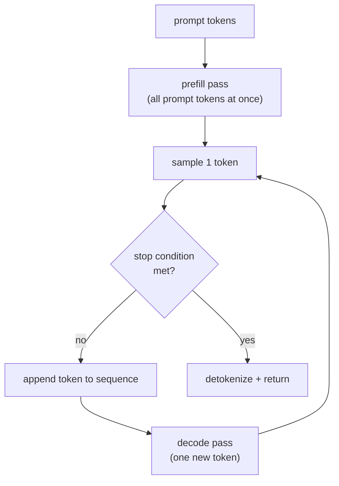

# Chapter 02 — The decode loop

## TL;DR

One forward pass gives you one token. Generation is that pass in a loop: append the sampled token, run the pass again, repeat until a stop condition fires. Two things turn this from a toy `while` into a production concern. First, **stopping is a *set* of conditions**, not `token == EOS` — length caps, multiple stop-token ids, stop *strings* (which live over decoded text, not token ids), and repetition/grammar terminators, all checked every step. Second, the naive loop **reprocesses the entire prefix on every step**, which is O(n²) and the reason the KV cache (Ch.04) exists. This chapter builds the loop, grounds its stop logic in vLLM's and SGLang's real finish-checkers, and makes you feel the cost curve the rest of the course is organized to flatten.

---

## Why this matters

The loop is where a language model stops being a text classifier and starts being a generator — and it is where three quietly expensive bugs live. Stop conditions that don't cover stop *strings* leak past the boundary you wanted. A loop with no hard length cap plus `ignore_eos` bills you for a runaway generation. And the naive "feed the whole sequence back each step" loop is correct, ships, passes tests on short prompts, and then falls over at O(n²) on a long one. Every one of these is invisible until you are staring at a latency graph or an invoice. Knowing the loop's real shape — and its cost trajectory — is what lets you predict all three before they happen.

---

## The concept

### The loop: feed the token back

Ch.01's pass maps tokens → one token. To generate text you close the loop: the token you just sampled becomes part of the input for the next pass.



```python
# The autoregressive loop, conceptually. Runtime detail is Ch.04–05.
tokens = tokenizer.encode(prompt)
logits = model.forward(tokens)          # PREFILL: all prompt positions in one pass (Ch.01)
while True:
    next_id = sample(logits[-1])        # last row only — the sampler from Ch.01
    tokens.append(next_id)
    if stop(tokens):                    # a SET of conditions — see below
        break
    logits = model.forward(tokens)      # DECODE: naively, reprocess EVERYTHING again
```

Notice the loop has **two regimes**, exactly the split Ch.01's roofline predicted: the first pass (prefill) is compute-bound on many prompt tokens; every pass after (decode) is memory-bound on one token. The same `model.forward` is a different performance object depending on how many new tokens it processes. Hold that — the last section costs it.

### Stopping is a set of conditions, not `== EOS`

The toy loop stops on end-of-sequence. Real generation stops on whichever of *several* conditions fires first, and the order matters. Here is vLLM's, which is the whole set in one readable function:

```python
# vLLM — when does the loop stop?  vllm/v1/core/sched/utils.py @ ae098ab  (check_stop)

if request.num_output_tokens < sampling_params.min_tokens:
    return False                                          # L100 min_tokens FLOOR: suppress stops below it
last = request.output_token_ids[-1]
if last == sampling_params.eos_token_id:                  # L104 the model's natural end token
    request.status = FINISHED_STOPPED; return True
if last in (sampling_params.stop_token_ids or ()):        # L108 caller-supplied stop ids (distinct from EOS)
    request.status = FINISHED_STOPPED; request.stop_reason = last; return True
if (request.num_tokens >= max_model_len                   # L112 TWO different length caps:
        or request.num_output_tokens >= request.max_tokens):  #   context window  OR  requested budget
    request.status = FINISHED_LENGTH_CAPPED; return True
if repetition_detection and check_sequence_repetition(...):  # L120 degenerate-loop guard (guard spans L120–128)
    request.status = FINISHED_REPETITION; return True
return False
```

Four things this teaches that `if token == eos: break` hides:

1. **`min_tokens` gates every other stop (L100).** An EOS sampled before the floor is *ignored*. If you've ever wondered why a model "won't stop early even though it wants to," this is the lever.
2. **EOS and `stop_token_ids` are different things (L104 vs L108).** EOS is the model's learned end token; `stop_token_ids` are caller-supplied (e.g. a chat turn delimiter). Both end the run, but only one is the model's idea.
3. **There are two length caps, and they mean different things (L112).** `max_model_len` is the context window (a hard architectural limit); `max_tokens` is the *requested* output budget. Hit either → `FINISHED_LENGTH_CAPPED`. Confusing them is a classic "why did my long-context request truncate" bug.
4. **Stop *strings* are not here.** This function only sees token ids. A stop like `"\n\n"` or ` ``` ` is a property of the *decoded text*, so it is checked in a different place entirely (the detokenizer) — the next section is why.

### Two production stop-checkers, one contract

SGLang does the same job with a different shape — read it as a diff, and note where it genuinely diverges:

```python
# SGLang — Req.update_finish_state  schedule_batch.py @ 52c6e27

if len(self.output_ids) >= sampling_params.max_new_tokens: ...   # L1415 length cap
if self.grammar and self.grammar.is_terminated(): ...            # L1422 structured-output finished
new = self.output_ids[-new_accepted_len:]                        # L1427 scan ALL newly-accepted tokens
self._check_vocab_boundary_finish(new)  # L1430 FIRST: out-of-range/NaN id → sanitize before any decode (def L1390; ties Ch.01)
self._check_str_based_finish(...)       # L1436 THEN: stop_strs AND stop_regex over a decoded tail window (def L1357)
self._check_token_based_finish(new)     # L1439 LAST: stop_token_ids + eos + additional; honors ignore_eos (def L1305)
# order is load-bearing — str before token, so a stop string beats an EOS accepted in the SAME multi-token
# (speculative) step; checking token first would trim only the last token and leak the stop string
```

**Verified agreements (in both files) — load-bearing, so in the durable body:** stopping is a *set* checked every step (length cap, EOS, explicit stop-token-ids distinct from EOS, stop strings over decoded text); a floor/length bound always exists; and the run carries a *reason* enum (`FINISHED_STOPPED` / `FINISH_MATCHED_TOKEN`, `FINISHED_LENGTH_CAPPED` / `FINISH_LENGTH`, …) — you always know *why* it ended.

**Verified divergences — placement and granularity, so quarantined here:**
- **Placement.** vLLM splits token-stops (in the scheduler's `check_stop`) from string-stops (in the detokenizer's `check_stop_strings`, L309 of `detokenizer.py`). SGLang gathers *all* finish types — token, string, regex, grammar, and out-of-range/NaN — into one `Req` method.
- **Granularity.** SGLang scans `new_accepted_len` tokens and records *where* it stopped (`finished_len`), because speculative decoding (Ch.08) can accept several tokens in one step and the stop may land mid-batch. vLLM's `check_stop`, in this function, inspects the last token per step. That multi-token reality also forces an *ordering*: SGLang checks stop **strings before** stop **tokens** (L1436 before L1439), so a stop string beats an EOS accepted in the same step — token-first would trim only the last token and leak the string. Neither placement is "more correct"; they reflect different choices about where multi-token acceptance is handled.

The agreement is the concept you keep; the placement/granularity is the part that will look different next release.

### Tokens aren't text — the detokenization boundary

Why can't stop strings live with the token checks? Because **the token↔text mapping is not one-to-one**. A single character can span multiple tokens; a single token can be a fragment of a multi-byte UTF-8 character. So "did the output contain ` ``` `?" cannot be answered from token ids — you must *decode* first, and you must decode *incrementally* as the loop runs (streaming can't wait for the end).

Two consequences that bite in production:

- **Stop strings are matched over a sliding window of decoded text**, not per-token — because the stop string can straddle a token boundary. Both engines do this windowed match (vLLM via `output_text.find` over a window sized to the new characters; SGLang via a `tail_str` window). SGLang goes one further with a *prefix* check — is the tail the *start* of a stop string? — to hold back streaming until it's sure; vLLM's cited path does containment only. Match on the newest token alone and you miss half of them.
- **You cannot emit a token's bytes the instant you sample it** if they complete only *part* of a character — you buffer until the character is whole, or you stream mojibake. Incremental detokenizers exist precisely to manage this partial-UTF-8 state.

This is why the loop has a detokenizer stage at all, and why "stop conditions" is split across two subsystems in vLLM. The lesson is durable even though the code isn't: **token-level decisions and text-level decisions happen at different layers, because they need different information.**

### The cost trajectory: why the naive loop is O(n²)

Return to the loop skeleton. The naive `model.forward(tokens)` inside the loop reprocesses the *entire* growing sequence every step. Generating token *k* pays a prefill-sized pass over *k* tokens. Sum it up:

```
step 1 processes ~P+1 tokens
step 2 processes ~P+2 tokens
...
step n processes ~P+n tokens
total work  ≈  Σ (P+k)  =  O(n²)   in the generated length n
```

Each step also re-derives *identical* intermediate keys and values for every prior position — the exact same numbers, recomputed. That is two kinds of waste at once: quadratic total work, and redundant work within each step. Ch.01 told you one decode step should cost ~`2N` FLOPs and read the weights once; the naive loop instead pays ~`2N·(P+k)` at step *k*, because it re-runs attention over the whole prefix. **The KV cache (Ch.04) is the fix**: save each layer's key/value vectors so a new token attends to the cached prefix instead of recomputing it, collapsing per-step work back to ~one token. You are meant to leave this chapter able to *derive* why the cache is mandatory, not just be told.

### The other per-step cost: CPU launch overhead and CUDA graphs

The KV cache kills the *GPU* waste per step. But a second per-step cost has nothing to do with FLOPs: **CPU kernel-launch overhead.** One decode step is one forward pass — hundreds of small GPU kernels (each layer's projections, attention, norms, then the sampler), and at decode's tiny batch each runs in microseconds, so the CPU time to *launch* them can rival the GPU time to *run* them. The loop goes launch-bound: the GPU stalls between kernels waiting for the CPU to issue the next. **CUDA graphs** fix it — capture the whole sequence of launches for a step once, then *replay* it with a single launch, so the CPU issues one call and the GPU runs the step back-to-back. The catch is static shapes: a captured graph hard-codes batch size and buffer pointers, but serving batches vary, so engines capture a *set* of graphs (one per batch-size bucket, padding to the nearest) or capture the model **piecewise** (graph the static per-layer compute, leave the dynamic attention outside). vLLM's `CudagraphDispatcher` selects FULL / PIECEWISE / NONE per batch descriptor (`vllm/v1/cudagraph_dispatcher.py`); SGLang carries per-phase `decode_cuda_graph_runner` / `prefill_cuda_graph_runner` with full and piecewise backends. Decode benefits far more than prefill: prefill's big compute-heavy kernels dwarf the launch overhead, while decode's tiny kernels are dominated by it — which is why this is a decode-loop concern.

### Prefill and decode are one loop with two regimes

Step back and name what you built. The loop is: one **prefill** pass (compute-bound, the whole prompt at once) followed by many **decode** passes (memory-bound, one token each), interleaved with sampling (Ch.01) and stop-checking (this chapter). Everything the rest of the course does to make serving fast is a transformation of *this* loop: the KV cache (Ch.04) kills its O(n²); batching (Ch.05) runs many copies of the decode phase together to amortize the weight reads; speculative decoding (Ch.08) tries to advance the loop more than one token per pass. Get the loop's shape and cost in your head now and each of those lands as an obvious optimization rather than a trick.

---

## Real-system notes

- **vLLM** — `check_stop` in `vllm/v1/core/sched/utils.py` @ `ae098ab` is the token-level stop set; stop *strings* are matched incrementally in `vllm/v1/engine/detokenizer.py` (`check_stop_strings`, L309). The split across scheduler and detokenizer is the "token decisions vs text decisions live at different layers" lesson in the wild.
- **SGLang** — `Req.update_finish_state` in `python/sglang/srt/managers/schedule_batch.py` @ `52c6e27` gathers length, grammar, token, string/regex, and out-of-range/NaN finishes in one place, and scans all newly-accepted tokens with a `finished_len` — built for multi-token (speculative) steps from the start.
- **Hugging Face Transformers** — `generate()` wraps this loop with `StoppingCriteria` objects and a `use_cache=True` KV cache on by default. Read it *after* building the loop by hand, or the abstraction hides both the stop set and the O(n²) you're avoiding.
- **llama.cpp** — the loop is explicit: `llama_decode` per step, sample, check for EOS/stop, `llama_decode` again. It runs on a laptop, so it's the place to *time* the naive-vs-cached difference yourself.

---

## Common failure cases

*These failures are durable; their fixes evolve fastest — each names the pattern and leaves current specifics to you and your AI partner.*

- **The unbounded loop.** `ignore_eos` (or a model that won't emit EOS) with no length cap bills you for a runaway generation. *Fix: the loop must always carry a hard cap — `max_tokens` and the context limit `max_model_len` — checked every step (both engines do; this chapter).*
- **The stop string that straddles a token boundary.** ` ``` ` arrives as two tokens; matching on the newest token id or newest decoded chunk alone misses it. *Fix: match stop strings over a sliding window of *decoded* text, with a prefix check for streaming — never on token ids (this chapter).*
- **EOS ignored (or honored) at the wrong time.** A model emits EOS before `min_tokens`, or you forgot the floor and it stops on the first token. *Fix: make the `min_tokens` gate explicit and know which behavior you want (vLLM L100).*
- **`max_model_len` vs `max_tokens` confusion.** A long prompt leaves no room for the requested output, or a big `max_tokens` silently truncates at the context window. *Fix: track both caps separately and surface *which* one fired via the finish reason (this chapter).*
- **Streaming mojibake.** Emitting a token's bytes before a multi-byte character is complete streams garbage. *Fix: incremental detokenization that buffers partial UTF-8 until the character is whole.*
- **Off-by-one on where the run stopped.** With multi-token/speculative steps, truncating after the whole accepted batch instead of at the matched position leaks tokens past the stop. *Fix: record the stop position (`finished_len`) and cut there (SGLang L1324/L1371).*
- **A launch-bound decode loop.** At small batch, per-kernel CPU launch overhead dominates the tiny decode kernels, so the GPU idles between launches. *Fix: capture the step with CUDA graphs (bucketed or piecewise) so one launch replays the whole step (this chapter, Ch.16).*

---

## Pair with your agent

- *"Write the smallest real decode loop in my stack — prefill, sample, append, stop, repeat — with a stop *set* (EOS, a stop-token-id, a stop string, and a max-tokens cap), and show me each firing."*
- *"Reproduce the O(n²): time my naive loop (re-forward the whole sequence each step) vs. one with `use_cache=True` across output lengths 16/64/256/1024, and plot per-token latency. Explain the shape against Ch.01's roofline."*
- *"Profile one decode step on my model — count the kernel launches and compare CPU launch time against GPU compute time. Then enable CUDA graphs and show me the per-token latency drop, and why prefill barely changes."*
- *"Make a stop string straddle a token boundary on purpose (e.g. a fence ` ``` `) and show me how token-id matching misses it and windowed-text matching catches it."*
- *"Open `references/vllm/vllm/v1/core/sched/utils.py` `check_stop` and `references/sglang/.../schedule_batch.py` `update_finish_state`. List what they agree on vs. where they diverge, and explain why SGLang scans `new_accepted_len` tokens while vLLM checks the last."*
- *"Set `ignore_eos` with no cap against a small model and show me the runaway — then add the hard cap that stops it, and log which finish reason fired."*

---

## What's next

You now have the loop, its stop set, and the O(n²) that makes the naive version untenable. Ch.03 steps back to the loop's *input* contract — tokenization and the chat template — the boundary where text becomes the token ids this loop consumes, and where a whole class of silent bugs (wrong special tokens, mismatched templates) is born. Then Ch.04 cashes the check this chapter wrote: the KV cache that turns the O(n²) loop back into linear time.
