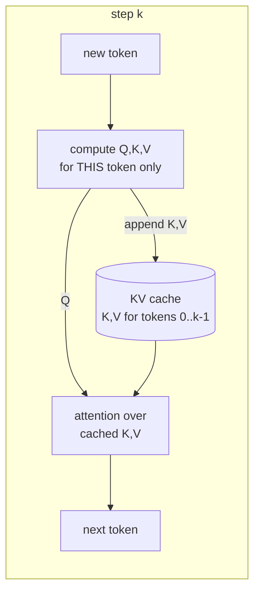

# Chapter 04 — The KV cache

## TL;DR

Ch.02 left you with an O(n²) loop that recomputes the entire prefix on every decode step. The KV cache is the fix, and it is the single most important object in serving. Attention needs the key and value vectors of *every past token*; those never change once computed, so you store them and a new token attends to the stored prefix instead of recomputing it. That collapses per-step work from "reprocess everything" to "process one token." But the cache is enormous — `2 × n_layers × n_kv_heads × head_dim × dtype_bytes` per token, gigabytes per long request — and unlike model weights it is *private to each request and grows every step*. So the cache trades Ch.02's compute problem for a memory problem, and that memory problem is what Ch.05–09 spend their whole time managing. This chapter builds the cache, sizes it against real source, and shows why it — not the weights — usually caps how many users you can serve.

---

## Why this matters

Everything downstream is downstream of this one object. "How many concurrent requests fit on this GPU?" is a KV-cache question. "Why does throughput fall off a cliff at long context?" is a KV-cache question. "Should I use GQA, quantize the cache, or page it?" are all KV-cache questions. The weights are a fixed cost you pay once; the KV cache is a per-request, per-token cost that scales with everything you care about. If you can compute its size from a model config in your head, you can predict your serving capacity before you rent the GPU — and you can read the design of vLLM and SGLang as a series of increasingly clever answers to "the cache is too big."

---

## The concept

### Decode attends to the past instead of recomputing it

Recall the attention step: to produce the next token, the model computes a query vector for the current position and attends it against the key and value vectors of *all positions so far*. In Ch.02's naive loop, every decode step re-ran the whole prefix through every layer just to regenerate those keys and values — the same numbers, over and over.

The insight: **a past token's key and value never change.** Position 5's K and V are the same at step 6, step 600, and step 6000. So compute them once and keep them. Then a decode step only has to: compute Q, K, V for the *one* new token, append that token's K and V to the store, and attend the new Q over the stored K/V. Per-step work drops from ~`2N·(P+k)` (Ch.02) to ~`2N` — one token's worth. The O(n²) loop becomes O(n). That store is the **KV cache**.



### What the cache actually stores

The cache is not exotic — it is a set of big tensors. SGLang's is the clearest to read: one key buffer and one value buffer *per layer*, each holding a fixed number of token slots:

```python
# SGLang — the KV cache IS per-layer K/V tensors indexed by token slot.
# sglang/.../mem_cache/memory_pool.py @ 52c6e27  (MHATokenToKVPool, default NHD layout)

# "[size, head_num, head_dim] for each layer"   <-- SGLang's own comment, L1510
self.k_buffer = [torch.zeros((self.size + self.page_size, self.head_num, self.head_dim),   # L1512
                             dtype=self.store_dtype, device=self.device)
                 for _ in range(self.layer_num)]                                            # one per layer
self.v_buffer = [torch.zeros((self.size + self.page_size, self.head_num, self.v_head_dim), # L1520
                             dtype=self.store_dtype, device=self.device)
                 for _ in range(self.layer_num)]
# self.size = number of token SLOTS carved from leftover GPU memory; head_num = KV heads.
# (the +page_size is a padding slot; the physical layout NHD/HND/... is a backend detail, L1326 — paging is Ch.06.)
```

So the cache is dimensioned by four things per token: **2** (a K and a V), **n_layers** (one buffer pair each), **n_kv_heads** (`head_num`), and **head_dim** — times the bytes of the dtype. The total capacity is that per-token cost times `size`, the number of token slots the engine pre-carved. Every token you generate consumes one slot in every layer's buffers.

### How big: the formula that eats your GPU

vLLM writes the per-token cost as an explicit byte formula (per block; a block is `block_size` tokens):

```python
# vLLM — bytes for one block of KV.  vllm/v1/kv_cache_interface.py @ ae098ab  (AttentionSpec.real_page_size_bytes)
return (
    2                             # L197  K and V
    * self.block_size             # L198  tokens per block
    * self.num_kv_heads           # L199  ← KV heads, NOT query heads (the reason GQA/MQA shrink the cache)
    * head_dim                    # L200
    * get_dtype_size(self.dtype)  # L201  bytes per element (fp16 = 2, fp8 = 1)
)
```

Per *token*, across the whole model, that is:

```
KV bytes / token  =  2 × n_layers × n_kv_heads × head_dim × dtype_bytes
```

Put real numbers in. Take a 32-layer model with 8 KV heads, head_dim 128, in fp16:

```
2 × 32 × 8 × 128 × 2 bytes  =  131,072 bytes  ≈  128 KiB per token
→ an 8,192-token request:  8,192 × 128 KiB  ≈  1 GiB  of KV cache, for ONE request
→ a batch of 32 such requests:  ≈ 32 GiB
```

That 32 GiB (≈34 GB) is **more than double the ~16 GB of weights** for an 8B model in fp16. Read that again: at long context and modest batch, the cache outweighs the model. This is the whole reason the rest of the course exists. Plug your own model's config into the formula with your agent — it is the most useful back-of-envelope in serving, and it is exactly Ch.01's "the KV term does not amortize across the batch" made arithmetic.

### GQA/MQA is the formula's biggest lever

Look at which "heads" the formula uses: **`n_kv_heads`, not `n_query_heads`.** That is not a detail — it is why modern models are built the way they are. In vanilla multi-head attention, every query head has its own KV head. **Grouped-query attention (GQA)** shares one KV head across a group of query heads; **multi-query attention (MQA)** uses a single KV head for all of them. The quality cost is small; the *memory* payoff is the group ratio. The model above has 32 query heads but only 8 KV heads — a 4× smaller cache than full MHA would need. Without GQA, that same batch-of-32 would want ~128 GiB of KV. **GQA is, first and foremost, a serving-memory decision.** (Ch.07 covers what it does to the attention kernel; here it is purely the lever on this formula.)

### Prefill writes the cache; decode extends it

The two regimes from Ch.01 and Ch.02 map cleanly onto the cache. **Prefill** computes K and V for *all* prompt tokens at once and writes them into the buffers — so prefill is not only compute-heavy, it is a big cache *write* proportional to prompt length. **Decode** appends exactly one token's K/V per step and reads the whole cache to attend. So a long prompt costs cache capacity *immediately* (the moment it is prefilled), not gradually — which matters when you are deciding whether a new request even fits.

### The KV cache is the new bottleneck

Ch.01 said decode is memory-bound on reading the weights, and that batching amortizes those weight reads across the batch. Now you can see the *other* memory term concretely: every decode step also reads (and grows) the KV cache, and **that read does not amortize** — each request has its own private cache, sized to its own context. So as you push batch size and context length up to chase throughput, KV traffic and KV *capacity* become the ceiling the weights never were. The rest of the foundations are responses to exactly this:

- **Batching (Ch.05)** amortizes the weight reads but multiplies the cache — so it is bounded by how many caches fit.
- **Paged memory (Ch.06)** stops the cache from wasting capacity to fragmentation.
- **Quantization (Ch.09)** shrinks `dtype_bytes` in the formula — often the cheapest capacity you can buy.

### The allocation problem — a fixed pool of slots

One more thing the source reveals: notice `self.size` is fixed at construction. Engines don't grow the cache per request on demand — they **pre-carve a single pool of token slots** from whatever GPU memory is left after loading weights (`free_memory / KV-bytes-per-token = total slots`), then hand slots out. This raises an obvious problem: you don't know how long a request will run, so how do you allocate its slots without either over-reserving (wasting capacity) or fragmenting the pool? The naive answer — a contiguous span per request, sized to `max_tokens` — wastes enormous memory on requests that stop early. **That waste is what PagedAttention (Ch.06) eliminates**, by handing out fixed-size *blocks* on demand instead of contiguous spans. This chapter builds the cache and its cost; Ch.06 makes its allocation efficient.

---

## Real-system notes

- **SGLang** — `MHATokenToKVPool` in `python/sglang/srt/mem_cache/memory_pool.py` @ `52c6e27` allocates one K and one V buffer per layer, shape `[size, head_num, head_dim]` (its own comment, L1510), and logs the exact allocated GB (`_finalize_allocation_log`, L1232). The physical layout (NHD/HND/vectorized_5d) is a backend-selectable detail; the dimensions are the invariant.
- **vLLM** — `AttentionSpec` in `vllm/v1/kv_cache_interface.py` @ `ae098ab` states the per-block byte cost as `2 × block_size × num_kv_heads × head_size × dtype_size` (`real_page_size_bytes`, L196–202) and derives the number of GPU blocks that fit from it. This is where "how many tokens can I cache" is decided.
- **llama.cpp** exposes the cache size as a launch parameter (`--ctx-size`, `--parallel`) and will tell you it ran out of KV slots — the cheapest place to *feel* the capacity limit by watching requests get rejected when the pool fills.

---

## Common failure cases

*These failures are durable; their fixes evolve fastest — each names the pattern and leaves current specifics to you and your AI partner.*

- **Sizing capacity from weights, not from the cache.** "The 8B fits in 16 GB, so I have headroom" ignores that the KV cache can dwarf the weights at long context. *Fix: budget `free_mem − weights` against `2 × n_layers × n_kv_heads × head_dim × dtype` per token, and derive concurrency from that (this chapter).*
- **Assuming batching scales concurrency for free.** Doubling the batch doubles the number of private caches; you hit the KV ceiling, not the FLOPs ceiling. *Fix: treat KV capacity as the concurrency limiter at long context; measure slots, not just tokens/sec (Ch.05).*
- **Ignoring `n_kv_heads` vs `n_query_heads`.** Estimating cache size from query heads over-counts by the GQA group ratio (or under-plans when moving off a GQA model). *Fix: the formula uses KV heads — read them from the config (this chapter).*
- **Long prompts silently exhausting the pool.** A big prompt writes its entire KV during prefill, so it consumes capacity up front and can starve concurrent requests. *Fix: account for prompt length in admission, not just generated length (Ch.11).*
- **Over-reserving contiguous cache per request.** Allocating `max_tokens` of contiguous cache per request wastes most of it on early-stopping requests. *Fix: on-demand block allocation — the paged cache (Ch.06).*

---

## Pair with your agent

- *"Compute my model's KV-cache bytes per token from its config (`2 × n_layers × n_kv_heads × head_dim × dtype_bytes`), then tell me how many 8k-token requests fit in the memory left after weights on my GPU. Show the arithmetic."*
- *"Reproduce the win: time my decode loop with `use_cache=False` vs `True` across output lengths, and confirm per-token latency goes from rising (O(n²)) to flat (O(n)). Tie it to Ch.02's derivation."*
- *"Take my model and a hypothetical full-MHA version (n_kv_heads = n_query_heads). Compute both KV sizes for a batch of 64 at 4k context and show me how much memory GQA is saving."*
- *"Open `references/sglang/.../memory_pool.py` (`MHATokenToKVPool`) and `references/vllm/vllm/v1/kv_cache_interface.py` (`real_page_size_bytes`). Show me the cache's shape in one and its byte formula in the other, and confirm they agree on the per-token cost."*
- *"Given my GPU's free memory and my model, what's the max total tokens (prompt + generated) I can hold across all concurrent requests? Now show what quantizing the KV cache to fp8 does to that number."*

---

## What's next

You now have the object the whole course orbits: the KV cache, its `2 × n_layers × n_kv_heads × head_dim × dtype` cost, and the reason it — not the weights — bounds concurrency. Ch.05 takes the next step: **batching**, which runs many requests' decode steps through one forward pass to amortize the weight reads Ch.01 identified — and immediately runs into the cache-capacity wall this chapter built, which is what makes *continuous* batching (and Ch.06's paging) necessary rather than optional.
