# Chapter 05 — Batching

## TL;DR

Ch.01 showed that a single decode step reads *all* the model's weights to produce *one* token, leaving the GPU mostly idle — decode is memory-bound. Batching is the fix: run many requests' decode steps through one forward pass, read each weight once, and produce one token *per request* from it. That amortizes the weight reads and lifts throughput roughly linearly with batch size. But the naive form — **static batching** — stalls, because requests finish at different lengths and new ones can't join until the whole batch drains. **Continuous batching** fixes that by reforming the batch *every step*: finished requests leave, waiting ones join, at single-step granularity. This chapter builds both, grounds continuous batching in vLLM's and SGLang's schedulers, and shows why it immediately collides with Ch.04's KV wall — which is what makes paging (Ch.06) non-optional.

---

## Why this matters

Batching is the difference between a GPU serving one user and the same GPU serving a hundred at nearly the same cost per token. It is the single highest-leverage throughput lever in serving, and its modern form — continuous batching — is *the* idea that made open LLM serving economical. But it is not free: batching multiplies the KV cache, so the same lever that raises throughput also drives you into the memory ceiling Ch.04 built. Understanding *where* batching helps (weight reads) and *where* it stops (KV capacity) is what lets you pick a batch size on purpose instead of discovering it in an out-of-memory crash.

---

## The concept

### Why batching works: amortize the weight reads

Ch.01's roofline said a batch-1 decode step reads every weight from memory to compute one token — arithmetic intensity ~1, deeply memory-bound, GPU idle. Now stack B requests' current tokens into one forward pass. The weights are read **once** and reused across all B tokens; you get B tokens out for one pass over the weights. Intensity climbs from ~1 toward the ridge, and throughput rises roughly linearly with B until something else becomes the bottleneck. This is exactly Ch.01's "batching B decode requests is like a prefill of width B — for the weight matmuls" made operational. It is the whole reason to batch, and its ceiling (the KV cache, whose reads *don't* amortize) is the whole reason batching is hard.

### Static batching and why it stalls

The obvious implementation: collect B requests, run them together until they all finish, then take the next B. This is **static batching**, and it wastes the GPU two ways:

```mermaid
gantt
    title Static batching — the GPU waits for the slowest request
    dateFormat X
    axisFormat %s
    section Req A (short)
    generating :0, 3
    idle (done, slot wasted) :crit, 3, 10
    section Req B (long)
    generating :0, 10
    section Req C (waiting)
    blocked in queue :active, 0, 10
```



- **Ragged finish.** Requests generate different numbers of tokens. When A finishes at step 3 but B runs to step 10, A's slot sits idle for 7 steps — you're paying for a batch of 3 but computing a batch that shrinks to 1.
- **Head-of-line blocking.** New request C can't start until the *entire* current batch drains, even though there's idle capacity the moment A finishes.

At realistic, high-variance output lengths, static batching leaves most of the GPU idle most of the time. The fix is to stop treating "the batch" as a fixed unit.

### Continuous batching: reform the batch every step

The insight: a decode step is independent per request, so there's no reason the batch has to be stable across steps. **Continuous batching** (a.k.a. in-flight batching) rebuilds the running set *at every step* — finished requests drop out immediately, freeing their slot, and waiting requests join the moment there's room. vLLM's scheduler states the mental model exactly:

```python
# vLLM — continuous batching: no phases, just a per-step token budget.
# vllm/v1/core/sched/scheduler.py @ ae098ab  (Scheduler.schedule)

# There's no "decoding phase" nor "prefill phase" in the scheduler.   (L398–407, verbatim)
#   ... At each step, the scheduler tries to assign tokens to the requests
#   so that each request's num_computed_tokens can catch up its num_tokens_with_spec.

token_budget = self.max_num_scheduled_tokens        # L416 tokens this ONE step may process
# First, schedule the RUNNING requests (each decode wants ~1 token):
req_index = 0
while req_index < len(self.running) and token_budget > 0:   # L442 fill from running first…
    ...                                                      # …then admit WAITING requests (prefill) with the leftover budget
```

There is no "batch" object that runs to completion — there is a *token budget* spent each step across whatever requests exist. A finished request simply isn't in `self.running` next step; a newly arrived one gets admitted as soon as budget and KV allow. The GPU stays full.

### The token budget: decode-first, then prefill

The scheduler's job each step is to spend a fixed **token budget** (`max_num_scheduled_tokens`). Running requests are scheduled first — each contributes ~1 decode token, so a batch of 200 running requests is only 200 tokens, cheap. Whatever budget remains admits *waiting* requests, whose prefill can be hundreds or thousands of tokens. This ordering is deliberate: it keeps in-flight requests advancing (protecting their latency) and backfills spare capacity with new work.

Because one long prompt could blow the entire budget and freeze everyone's decode, big prefills are **chunked** — split across steps so a 10k-token prompt is prefilled a slice at a time while decodes keep flowing. This is why vLLM's comment says the scheme "is general enough to cover chunked prefills": prefill and decode aren't phases, they're just tokens competing for the same per-step budget.

### Two engines, one loop

Verified in both sources. **Agreement (load-bearing):** both maintain a *persistent running set* that requests join and leave at step granularity, rather than a fixed batch that runs to completion. vLLM expresses it as a per-step token budget spent over `self.running` then the waiting queue (`Scheduler.schedule`); SGLang keeps an explicit `self.running_batch` (L980) and, each step, **"merge[s] the prefill batch into the running batch"** (`get_next_batch_to_run`, L2596/L2606) so freshly-prefilled requests join the decoders. **Divergence (policy, will rot):** vLLM leans on an explicit token budget with chunked prefill and preemption; SGLang forms a prefill batch and merges it into a running batch, with its own admission and retraction policy. The *continuous* part — reform the set every step — is the concept you keep; the scheduling policy is the part that differs between engines and releases.

### The KV wall: batching is bounded by cache, not FLOPs

Here is where Ch.04 comes back to collect. Every request in the running set has its own private KV cache (Ch.04's `2 × n_layers × n_kv_heads × head_dim × dtype` per token), and those reads *don't* amortize across the batch. So the binding constraint on batch size is almost never FLOPs — it's **KV capacity**. You can only admit a request if its KV will fit in the pool; when the pool fills, the scheduler must **preempt** — evict a running request's cache and re-run it later (vLLM's scheduler has an explicit preemption path that returns the freed budget to the step, `scheduler.py` L556 — shown there in the priority-policy branch; default FCFS preemption is a separate path). Continuous batching without efficient KV memory would spend all its time preempting. That is precisely why **paging (Ch.06)** exists: to pack the KV pool tightly enough that continuous batching can keep the running set large. Batching creates the memory pressure; paging relieves it; the two are a matched pair.

### Throughput vs. latency: the batch-size knob

Bigger batches raise throughput but not for free. A larger running set means each decode step does more work, so **per-token latency (TPOT) rises**; admitting more prefill raises **time-to-first-token (TTFT)** for everyone via budget contention. So batch size (and the token budget, and the prefill/decode split) is the fundamental **throughput-vs-latency knob** — max throughput and min latency pull in opposite directions, and where you set the dial depends on your SLO. Ch.16 measures these (TTFT, TPOT, goodput) and Ch.17 tunes them; here, just hold that "bigger batch" always means "more throughput, worse tail latency."

---

## Real-system notes

- **vLLM** — `Scheduler.schedule` in `vllm/v1/core/sched/scheduler.py` @ `ae098ab` is the continuous-batching core: a per-step `token_budget`, running-requests-first admission, chunked prefill, and a preemption path when KV blocks run out. The source comment (L398–407) is the clearest one-paragraph statement of the idea in either codebase.
- **SGLang** — `Scheduler.get_next_batch_to_run` (`python/sglang/srt/managers/scheduler.py` @ `52c6e27`, L2596) maintains a persistent `running_batch` (L980) and merges each newly-formed prefill batch into it (L2606), with `event_loop_normal` / `event_loop_overlap` variants for pipelining CPU scheduling against GPU compute.
- **Orca (paper)** introduced *iteration-level scheduling* (continuous batching) in 2022; every current engine is a descendant. Worth reading once for the origin of the idea the code above implements.
- **llama.cpp** exposes batching via `--parallel` / a batch API and is the easiest place to *watch* throughput climb with batch size — and then watch it stop climbing when the KV pool fills.

---

## Common failure cases

*These failures are durable; their fixes evolve fastest — each names the pattern and leaves current specifics to you and your AI partner.*

- **Static batching in production.** A fixed batch run to completion idles finished slots and blocks new arrivals; effective utilization collapses under variable output lengths. *Fix: continuous / iteration-level batching — reform the running set every step (this chapter).*
- **Sizing the batch by FLOPs, not KV.** Picking batch size from compute headroom hits an out-of-memory wall, because KV capacity binds first at long context. *Fix: bound batch size by the KV pool — `free_mem / KV-bytes-per-token` (Ch.04), and expect preemption near the limit.*
- **One long prompt freezing everyone.** Admitting a giant prefill in a single step blows the token budget and stalls all in-flight decodes. *Fix: chunked prefill — split long prompts across steps (this chapter).*
- **Preemption thrash.** Admitting more requests than the KV pool can hold makes the scheduler evict and re-run caches repeatedly, burning throughput. *Fix: admission control that reserves KV before admitting; treat preemption as a pressure signal, not normal operation (Ch.11).*
- **Chasing throughput past the SLO.** Maxing batch size maximizes tokens/sec but wrecks TTFT/TPOT tails. *Fix: set batch size against a latency SLO, not raw throughput (Ch.16, Ch.17).*

---

## Pair with your agent

- *"Serve a small model and plot tokens/sec vs. batch size from 1 to 64. Show me the near-linear climb (weight-read amortization) and where it flattens — then check whether it flattened on KV capacity or compute."*
- *"Simulate static vs. continuous batching with a spread of output lengths (say 8–512 tokens). Measure GPU-slot utilization for each and show me how much the ragged-finish idle time costs static batching."*
- *"Open `references/vllm/vllm/v1/core/sched/scheduler.py` `schedule` and `references/sglang/.../scheduler.py` `get_next_batch_to_run`. Show me where each reforms the running set per step, and contrast vLLM's token budget with SGLang's running_batch merge."*
- *"Push concurrent requests until my server starts preempting. Show me the throughput at that point and tie it back to the Ch.04 KV formula — how many token-slots did the pool actually have?"*
- *"Hold throughput fixed and sweep batch size; plot TTFT and TPOT against it so I can see the throughput-vs-latency trade and pick a batch size for a 200ms-TPOT SLO."*

---

## What's next

You now have the throughput engine — continuous batching — and its hard limit: the KV cache it multiplies. Ch.06 removes that limit's worst inefficiency. **PagedAttention** stops the KV pool from wasting capacity on fragmentation and contiguous over-reservation, so the running set can stay large and continuous batching can actually deliver the throughput this chapter promised. It is the piece that makes Ch.04's cache and Ch.05's batching co-exist at scale — and it closes the foundations: atom, loop, contract, cache, batch, and the paged memory that ties the last two together.
