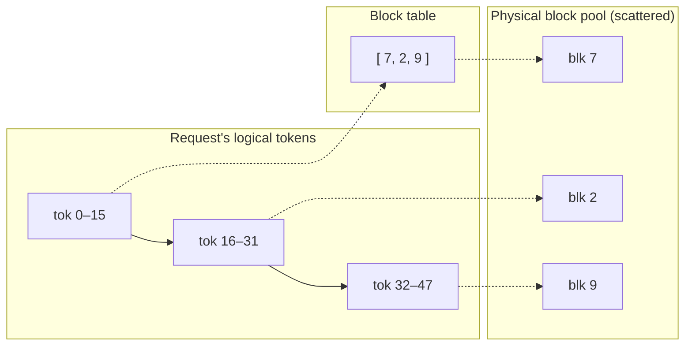

# Chapter 06 — PagedAttention

## TL;DR

Ch.04 built the KV cache; Ch.05 showed batching multiplies it and stalls when the pool fills. The naive way to store each request's cache — a contiguous span reserved up front for the maximum possible length — wastes most of the memory, both to *internal* fragmentation (a request that stops early leaves its reservation unused) and *external* fragmentation (free memory scattered in pieces too small to fit a new request). PagedAttention borrows the operating system's forty-year-old fix: store the cache in fixed-size **blocks** scattered anywhere in memory, and give each request a **block table** mapping its logical token positions to physical blocks. Allocate a block only when a sequence needs one; free them all when it finishes. Waste drops to at most one partial block per request, the same physical block can be *shared* across requests, and the running set can finally stay as large as continuous batching (Ch.05) wants. This is vLLM's foundational contribution, and it is the piece that makes Ch.04's cache and Ch.05's batching coexist at scale.

---

## Why this matters

Everything Ch.05 promised — near-linear throughput with batch size — is only real if you can actually fit the batch's KV in memory. With contiguous allocation you can't: reserving `max_tokens` per request means a handful of requests exhaust the pool while most of the reserved space sits empty, and your "batch of 64" is really a batch of 12. PagedAttention is what closed that gap and roughly tripled serving throughput on the same hardware when vLLM introduced it. It also turns out to be the *substrate* for prefix caching (Ch.12): once the cache is blocks behind a table, sharing a common prompt across requests is just two tables pointing at the same block. If you understand paging, half of the "how is this engine so much faster" questions answer themselves.

---

## The concept

### The problem: fragmentation from contiguous allocation

A KV cache grows one token at a time and stops at an unpredictable length (Ch.02's stop conditions). If you allocate it as a *contiguous* span, you face an impossible choice:

- **Reserve for the maximum** (`max_tokens`) up front → **internal fragmentation**: a request that generates 50 tokens against a 2,048 reservation wastes 97% of its allocation, and multiplied across the batch that empty space is your whole GPU.
- **Grow the span as needed** → you can't, because the next request's cache is already sitting in the adjacent memory. Even freeing finished requests leaves **external fragmentation**: plenty of total free memory, but scattered in fragments too small for a contiguous new request.

This is exactly the problem operating systems faced with physical RAM, and PagedAttention applies exactly their solution.

### PagedAttention: blocks and a block table

Stop storing each cache contiguously. Instead:

- Carve the KV pool into fixed-size **blocks** (a block holds `block_size` tokens' worth of K/V — commonly 16), all identical, allocatable anywhere.
- Give each request a **block table**: an array mapping its logical positions (tokens 0–15 → some physical block, 16–31 → another) to wherever those blocks physically live.
- Grow a sequence by handing it a new block *only when its current last block fills*; the blocks need not be adjacent.



This is virtual memory for the KV cache: the block table is a page table, the blocks are pages, and physical placement no longer has to match logical order.

### The block pool: allocate and free on demand

The engine holds one global pool of blocks and hands them out. vLLM's is the clearest:

```python
# vLLM — the KV cache as OS-style paged memory.  vllm/v1/core/block_pool.py @ ae098ab  (BlockPool)

self.blocks = [KVCacheBlock(idx) for idx in range(num_gpu_blocks)]  # L176 a FIXED pool of fixed-size blocks
self.free_block_queue = FreeKVCacheBlockQueue(self.blocks)          # L182 free blocks, kept in EVICTION order
self.cached_block_hash_to_block = BlockHashToBlockMap()             # L185 hash → block: lets requests SHARE blocks (Ch.12)

def get_new_blocks(self, num_blocks):                               # L542 allocate = pop from the free queue…
    ret = self.free_block_queue.popleft_n(num_blocks)             # L556 …then bump ref counts / evict cached blocks (L558–567) before `return ret` (L572)
def free_blocks(self, ordered_blocks):                             # L614 free = return the blocks to the queue
    ...
```

Allocation is a queue pop; freeing is a queue push. A sequence that needs another block pops one; a finished request returns all of its blocks at once. No pre-reservation, no contiguity requirement, and the free queue is kept in *eviction order* so that blocks which are free but still hold a cached prefix (Ch.12) are reclaimed least-recently-used first when the pool needs room.

### Why it wins: waste ≤ one block per request

The payoff is a bound. With paging, a request wastes at most the unused slots in its **last, partial block** — under `block_size` tokens, regardless of how long it *might* have run. Internal fragmentation goes from "up to `max_tokens` per request" to "under 16 tokens per request." External fragmentation disappears entirely: every free block is interchangeable, so any free block fits any request. Utilization of the KV pool jumps toward 100%, which directly means more concurrent requests fit, which means the running set Ch.05 wants stays large, which means the throughput Ch.05 promised actually materializes. Paging is not a micro-optimization; it is what makes continuous batching economically real.

### Sharing: the same block behind two tables

Because a request reaches its KV *through* a block table, two requests can point at the **same physical block**. That is enormous:

- A shared system prompt is prefilled once and its blocks referenced by every request that starts with it — the seed of **prefix caching** (Ch.12), which is exactly what vLLM's `cached_block_hash_to_block` map enables: look up a block by the hash of its content, and reuse it instead of recomputing.
- Parallel samples or beam search share the prompt's blocks and only diverge (copy-on-write) when their contents differ.

Contiguous allocation makes this impossible; paging makes it a reference count.

### The catch: the kernel must gather scattered blocks

There is no free lunch. Attention now needs to read a request's K/V from blocks scattered across memory, following the block table — not a single contiguous stride. A normal attention kernel can't do that. **PagedAttention is also a specialized attention kernel** that takes the block table and gathers K/V from the physical blocks as it computes. That kernel is Ch.07's territory (it composes with FlashAttention's memory-movement tricks); here, just hold that paging moves complexity out of the memory allocator and *into* the attention kernel — a trade that is worth it precisely because memory was the binding constraint.

### Block size: the trade-off

`block_size` is a real knob. **Larger blocks** mean shorter block tables and less per-block kernel/bookkeeping overhead, but more internal waste (a bigger partial last block) and coarser sharing. **Smaller blocks** waste less and share more finely, but lengthen the block table and add gather overhead. Common values cluster around 16 tokens — big enough to amortize overhead, small enough to keep the last-block waste negligible.

### Two engines, one idea

Verified in both. **Agreement (load-bearing):** both store the KV cache as a pool of fixed-size units allocated on demand from a free list, never as contiguous per-request spans. vLLM calls them **blocks** (`BlockPool`, `get_new_blocks` pops from `free_block_queue`); SGLang calls them **pages** (`PagedTokenToKVPoolAllocator`), and its extend path computes only the *new* pages a sequence needs as it extends and pulls them from `free_pages` (`num_new_pages = ceil(seq_len) − ceil(prefix_len)` over page_size, in the module-level `alloc_extend_naive`, paged.py L57). **Divergence (structure, will rot):** vLLM folds content-hash sharing into the block pool itself (`cached_block_hash_to_block`), so prefix caching lives in the same structure; SGLang keeps a separate radix-tree cache above a plainer page allocator (Ch.12). Same paging idea; different homes for the sharing logic.

### Paging closes the foundations

Step back: Ch.04 gave you the cache, Ch.05 gave you batching, and Ch.06 gave you the memory manager that lets the two coexist. Together they are the trio that turned LLM serving from "one request per GPU" into "a hundred requests per GPU at the same cost per token." Everything after this is refinement on top of a working, memory-efficient, continuously-batched loop: faster kernels (Ch.07), fewer steps (Ch.08), smaller footprints (Ch.09), smarter scheduling (Ch.11), reused prefixes (Ch.12).

---

## Real-system notes

- **vLLM** — `BlockPool` in `vllm/v1/core/block_pool.py` @ `ae098ab`: a fixed pool of `num_gpu_blocks` blocks, a `free_block_queue` in eviction order (`get_new_blocks` pops, `free_blocks` returns), and a `cached_block_hash_to_block` map that makes prefix caching a block lookup. `KVCacheManager.allocate_slots` (`kv_cache_manager.py` L244) drives it per request. PagedAttention originated here (the vLLM paper, SOSP 2023).
- **SGLang** — `PagedTokenToKVPoolAllocator` in `python/sglang/srt/mem_cache/allocator/paged.py` @ `52c6e27` allocates page-granular, computing the new pages a sequence needs on extend and pulling from a free-page pool; sharing lives in a separate radix cache (RadixAttention, Ch.12) rather than in the allocator.
- **llama.cpp** historically used a simpler contiguous per-sequence KV layout and has moved toward paged/unified KV over time — a useful contrast for *seeing why* paging matters when you watch a contiguous cache fragment under mixed-length load.

---

## Common failure cases

*These failures are durable; their fixes evolve fastest — each names the pattern and leaves current specifics to you and your AI partner.*

- **Contiguous, max-length KV reservation.** Reserving `max_tokens` of contiguous cache per request wastes most of the pool and caps concurrency far below the hardware's real capacity. *Fix: paged/block allocation on demand (this chapter).*
- **Treating "out of KV memory" as "need a bigger GPU."** Fragmentation, not raw capacity, is often the culprit — total free memory is fine, but it's unusable in pieces. *Fix: measure fragmentation/utilization, not just free bytes; paging removes external fragmentation entirely (this chapter).*
- **Block size picked blindly.** Too large wastes memory on partial last blocks and coarsens sharing; too small bloats the block table and gather overhead. *Fix: tune `block_size` (≈16 is a common default) against your length distribution and kernel (this chapter).*
- **Forgetting the kernel side.** Paging the memory but pairing it with an attention kernel that assumes contiguous KV silently breaks or slows everything. *Fix: use a paged-aware attention kernel; the two are a matched pair (Ch.07).*
- **Sharing without reference counting.** Letting two requests share a block and then mutating it corrupts both. *Fix: copy-on-write with ref counts — the discipline that makes prefix caching safe (Ch.12).*

---

## Pair with your agent

- *"Draw my KV pool under contiguous max-length reservation vs. paged blocks for a batch of 32 requests with output lengths 20–1500. Compute wasted memory and max concurrent requests for each."*
- *"Open `references/vllm/vllm/v1/core/block_pool.py` (`BlockPool`, `get_new_blocks`, `free_blocks`) and walk me through allocate-and-free as queue pop/push. Then show me where `cached_block_hash_to_block` would let two requests share a block."*
- *"Contrast vLLM's `block_pool.py` with `references/sglang/.../allocator/paged.py`. Both page the cache — show me where each does it and where SGLang's sharing lives instead (the radix cache)."*
- *"Simulate block_size 4 / 16 / 64 on my length distribution: report last-block internal waste, block-table length, and how many requests fit. Recommend a block size."*
- *"Show me a copy-on-write bug: two requests share a prompt block, one appends, and without a ref count the other's cache corrupts. Then add the ref count that fixes it."*

---

## What's next

The foundations are complete: the atom (Ch.01), the loop (Ch.02), the input contract (Ch.03), the cache (Ch.04), batching (Ch.05), and the paged memory that makes the last two coexist (Ch.06). But paging left a bill: attention must now gather K/V from scattered blocks, and even contiguous attention is memory-movement-bound. Ch.07 pays it — **FlashAttention and the attention kernels** — where you'll see why the bottleneck inside a forward pass is moving bytes, not doing math, and how the paged, batched cache you just built gets read fast.
