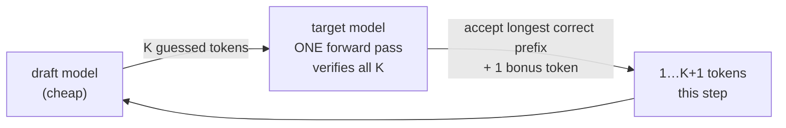

# Chapter 08 — Speculative decoding

## TL;DR

Since Ch.01, one forward pass of the big model has produced exactly one token, and Ch.01 showed *why that wastes the GPU*: decode reads every weight from memory to make a single token, leaving the compute units idle. Speculative decoding spends that idle compute. A cheap **draft** proposes several tokens ahead; the big **target** model verifies all of them in **one** forward pass; a **rejection-sampling** check accepts the longest correct prefix plus one bonus token. Because verifying K tokens is the same single weight-read as generating one, every accepted draft token beyond the first is nearly free — so a good draft yields 2–3× fewer target passes at the *exact same output distribution* (it is lossless, not an approximation). The catch: it only helps where there's idle compute to spend, which puts it in direct tension with batching (Ch.05). This chapter breaks the one-pass-one-token rule and closes the throughput block.

---

## Why this matters

Speculative decoding is the main lever for **latency** the way batching is the main lever for **throughput** — and understanding *why* they're different levers, pulling on the same idle-compute budget from opposite ends, is what lets you tune a serving stack instead of cargo-culting flags. It routinely cuts per-token latency 2–3× for a single stream with no quality change, which is why every latency-sensitive deployment (chat, coding assistants) uses it. But turn it on under heavy batch and it can *slow you down*, because there's no idle compute left to spend. Knowing the mechanism tells you exactly when it's a win.

---

## The concept

### The rule it breaks

Every chapter so far obeyed: one target forward pass → one token. Ch.01 also told you that pass is memory-bound — the GPU reads all N weights to produce that one token and has FLOPs to spare. Speculative decoding asks: if we're going to read all the weights anyway, can we get *more than one token* out of the pass? Yes — if we already have candidate tokens to check.

### Draft cheap, verify in parallel



- The **draft** generates K candidate tokens quickly (a small model, or a lightweight head — see below).
- The **target** takes those K tokens as a fixed sequence and runs **one** forward pass over all of them, producing its own next-token distribution at *every* position. This is the same parallelism as prefill (Ch.01): K known tokens, processed at once.
- A **verify** step accepts the longest prefix of draft tokens the target agrees with, then adds one **bonus** token from the target's own distribution. One target pass yields **1 to K+1** tokens.

### Why it's nearly free — the Ch.01 payoff

Here's the crux. That one verify pass over K+1 tokens reads the weights **once** — the same memory traffic as generating a single token (Ch.01: decode is memory-bound, so cost is set by the weight read, not the token count). So verifying 5 tokens costs almost exactly what generating 1 does. Every token the target *accepts* beyond the first is compute you were wasting anyway. Speculative decoding is the sharpest expression of Ch.01's whole lesson: decode leaves compute on the table, and this spends it on checking guesses. The speedup is roughly the **mean number of tokens accepted per pass**.

### Verify and accept, losslessly

The target's logits at every draft position come out of that one pass; the accept step turns them into output tokens:

```python
# vLLM — verify K draft tokens against the target in ONE pass; accept a prefix + a bonus.
# vllm/v1/sample/rejection_sampler.py @ ae098ab  (rejection_sample)

def rejection_sample(
    draft_token_ids,     # the draft's K guessed tokens
    num_draft_tokens,
    ...
    target_logits,       # L405 the TARGET's logits at each draft position — one verify pass produced them all
    bonus_token_ids,     # L407 the free extra token the target gives after the last accepted draft token
    sampling_metadata, ...):
    output_token_ids = torch.full(
        (batch_size, max_spec_len + 1), PLACEHOLDER_TOKEN_ID, ...)   # L428 accept 1…K draft tokens, +1 bonus
    if sampling_metadata.all_greedy:                                 # L435 branch on greedy vs. sampling (sets is_greedy)…
        ...   # greedy path (kernel at L456): accept while draft == target argmax, stop at first mismatch
    else:
        ...   # sampling path (L472+): accept token i w.p. min(1, p_target/p_draft); on reject, resample — target dist preserved
```

The critical property, stated in the code's structure and provable on paper: **the output distribution is identical to sampling from the target model alone.** For greedy decoding, accept each draft token while it equals the target's argmax, stop at the first mismatch, and take the target's token there. For temperature sampling, accept draft token *i* with probability `min(1, p_target(i) / p_draft(i))`; on rejection, resample from the normalized positive part of `p_target − p_draft`. This rejection-sampling correction makes speculative decoding **lossless** — exactly like FlashAttention (Ch.07) was exact, not approximate. You get the target's quality, faster; you do not trade quality for speed.

### The acceptance rate is everything

Speedup = mean accepted length, and that depends entirely on **how often the draft guesses what the target would have said.** A draft well-aligned with the target (trained on the same data, or derived from the target) accepts most of its tokens → big speedup. A poorly-aligned draft gets rejected constantly → you pay for draft generation *and* the verify pass and gain little, or lose. So the whole game is a draft that is simultaneously **cheap** (or it eats its own savings) and **accurate** (or nothing is accepted). Those pull against each other, which is why there are several ways to draft.

### Ways to draft

The proposer is pluggable, and the choices trade draft cost against acceptance:

- **A separate small model** — e.g. a 1B drafting for a 70B. Simple, but needs a well-aligned small model and its own weights/KV.
- **The target's own extra heads (Medusa)** — bolt lightweight heads onto the target to predict several tokens at once; no separate model.
- **A small head on the target's hidden states (EAGLE)** — predict draft tokens from the target's *features* rather than its tokens; high acceptance at low cost, currently the most popular.
- **N-gram / prompt lookup** — no model at all: propose the continuation from repeated text in the prompt/context. Nearly free, great for code and structured/repetitive output.

vLLM ships all of these as pluggable proposers (`draft_model.py`, `eagle.py`, `medusa.py`, n-gram) sharing a `propose()` interface and feeding one `RejectionSampler` — the draft-model and EAGLE proposers extend a common `SpecDecodeBaseProposer`, while Medusa and n-gram are standalone proposer classes; SGLang is EAGLE-centric with heavily CUDA-graph-optimized draft/verify workers (`speculative/eagle_worker_v2.py`).

### The draft spectrum: trees, native heads, and no model at all

Those four options are points on one axis — *how much of the target you reuse to draft* — and the trend is toward drafting for free:

- **Separate model → target heads (Medusa) → target features (EAGLE) → target-native (MTP) → no model (n-gram/suffix).** Draft *cost* falls toward zero along that line; the open question is always acceptance. **MTP** (multi-token prediction) is the far end: the model is *pretrained* with extra heads that predict several future tokens, so the draft is part of the target itself — DeepSeek-V3's design, which SGLang ships as a spec worker (`speculative/frozen_kv_mtp_worker_v2.py`).
- **Draft a tree, not a chain.** A single chain of K guesses accepts only up to its first wrong token. Propose a *tree* of candidate continuations and verify the whole tree in one pass with a **tree-attention mask**, and you accept the best root-to-leaf path — more expected tokens per pass. **EAGLE-2**'s contribution is making that tree *dynamic*, growing the branches the draft is most confident about. vLLM's **Suffix Decoding** (`spec_decode/suffix_decoding.py`, `max_tree_depth`) is the same tree idea at the no-model end: it builds the speculation tree from repeated suffixes already in the context.
- **No draft model at all.** Beyond n-gram/suffix lookup, *Lookahead/Jacobi* decoding produces candidate n-grams by parallel fixed-point iteration on the target itself, and *self-speculative* decoding drafts by running the target with layers skipped. Zero extra weights; lower acceptance, but nothing to align or maintain.

The engines expose this as a menu behind one interface — SGLang dispatches by a `SpeculativeAlgorithm` enum (`speculative/spec_info.py`, `create_worker`) across EAGLE, MTP, and n-gram workers (multi-layer EAGLE is an EAGLE mode, not a separate algorithm), with a `spec_registry.py` hook for *custom* plugins; vLLM does it behind its proposer classes — so "which drafter" is a config choice whose right answer is workload-dependent. Measure accepted length per method on *your* traffic.

### When it doesn't help — the batching tension

Speculative decoding spends **idle compute**. Ch.05's batching *also* fills idle compute — by running many requests through one weight read. So the two compete for the same resource, and this is the load-bearing operational insight:

- At **low batch / single stream** (latency-sensitive, memory-bound, lots of idle compute), speculative decoding is a big win — that's its home.
- At **high batch** (throughput-oriented, the GPU already compute-saturated by batching), there is no idle compute to spend; verifying draft tokens now *competes* with real work, and speculative decoding can be neutral or negative.

Add the direct costs — the draft's own latency and KV, and the wasted compute of rejected tokens — and the rule is: speculative decoding trades spare compute for fewer steps, so it pays off exactly when you have spare compute and care about latency. It is a latency tool, not a throughput tool, and it does not stack for free with aggressive batching.

### Two engines, one loop

Verified in both. **Agreement (load-bearing):** both implement draft → single-pass verify → **rejection-sampling** accept-a-prefix-plus-bonus, preserving the target distribution. vLLM: pluggable proposers + `rejection_sample` (`target_logits`, `bonus_token_ids`, output width `max_spec_len + 1`). SGLang: EAGLE draft/verify workers with the same accept-and-bonus structure. **Divergence (which drafts, will rot):** both expose a *menu* — vLLM's proposer classes (draft-model / EAGLE / Medusa / n-gram / suffix-decoding); SGLang's `SpeculativeAlgorithm` dispatch (EAGLE, MTP, n-gram, with multi-layer EAGLE as an EAGLE mode) — with different defaults and CUDA-graph specialization. The draft-verify-reject *loop* is the concept you keep; which drafting method and how it's optimized is what differs and changes.

---

## Real-system notes

- **vLLM** — `vllm/v1/spec_decode/` @ `ae098ab` holds the proposers (`draft_model.py`, `eagle.py`, `medusa.py`, `ngram_proposer.py`, `suffix_decoding.py`), each parameterized by `num_speculative_tokens` and feeding one rejection sampler (`draft_model.py` and `eagle.py` extend `SpecDecodeBaseProposer`; Medusa, n-gram, and suffix-decoding are standalone proposer classes); verification is `vllm/v1/sample/rejection_sampler.py` (`rejection_sample`, L394), which takes `draft_token_ids` + `target_logits` + `bonus_token_ids` and emits up to `max_spec_len + 1` accepted tokens per request.
- **SGLang** — `python/sglang/srt/speculative/` @ `52c6e27` dispatches draft workers by a `SpeculativeAlgorithm` enum (`spec_info.py`, `create_worker`): `eagle_worker_v2.py`, `frozen_kv_mtp_worker_v2.py` (multi-token prediction), and `ngram_worker.py` — with multi-layer EAGLE as an EAGLE mode (`multi_layer_eagle_worker_v2.py`) — over a shared `base_spec_worker.py` (`draft()` / `draft_extend()`) with dedicated CUDA-graph runners; `spec_registry.py` is a plugin hook for custom algorithms. EAGLE's small draft step benefits enormously from graph capture.
- **The papers** are the external primary source for the algorithms (not the engine code): Leviathan et al. and Chen et al. (2023) for speculative decoding + the rejection-sampling correctness proof; **Medusa** (2024) for extra heads; **EAGLE / EAGLE-2** (2024) for feature-level and dynamic-tree drafting; **Multi-Token Prediction** (DeepSeek-V3, 2024) for native draft heads; **Suffix Decoding** (2024, arXiv 2411.04975) for context-tree lookup. Ask your agent which draft method is winning on your model today — it moves fast.

---

## Common failure cases

*These failures are durable; their fixes evolve fastest — each names the pattern and leaves current specifics to you and your AI partner.*

- **Turning it on under heavy batch.** With the GPU already compute-saturated by batching, speculative decoding competes for compute it no longer has and can slow you down. *Fix: enable it for low-batch/latency-sensitive traffic; measure it against your real batch profile, not in isolation (this chapter, Ch.17).*
- **A misaligned draft.** A draft that rarely matches the target gets rejected constantly, so you pay draft + verify for ~1 token. *Fix: use a draft derived from or trained with the target (EAGLE/Medusa), and monitor acceptance rate as a first-class metric (Ch.16).*
- **Assuming it changes the output.** Fear that speculation degrades quality leads people to avoid it. *Fix: rejection sampling is provably lossless — the output *distribution* equals the target's. Verify it distributionally (compare token-frequency over many samples), or exact-match only under greedy/temp-0; under temperature > 0 a correct lossless run still yields a *different* token sequence per seed, so a fixed-seed exact-match check is valid for greedy alone (this chapter).*
- **Tuning K blindly.** Too few speculative tokens leaves speedup on the table; too many wastes draft compute on tokens that'll be rejected. *Fix: tune `num_speculative_tokens` to your measured acceptance-length distribution (this chapter).*
- **Ignoring draft KV/latency in the budget.** The draft has its own memory and per-step cost that eat into the win. *Fix: account for the draft's footprint when sizing the pool and the latency budget (Ch.04, Ch.17).*

---

## Pair with your agent

- *"Enable speculative decoding on my model (try n-gram and EAGLE drafts) at batch size 1 and measure per-token latency vs. no speculation. Report the mean acceptance length and the speedup. Confirm losslessness the right way: exact-match only under greedy/temp-0; under sampling, compare the token-frequency *distribution* against a non-speculative run — per-seed sequences differ even when the implementation is correct."*
- *"Now sweep batch size 1 → 32 with speculation on vs. off. Show me the batch size where speculation stops helping and explain it in terms of idle compute (Ch.01/Ch.05)."*
- *"Walk me through the rejection-sampling correction: accept w.p. min(1, p_target/p_draft), resample from (p_target − p_draft)+ on reject. Prove the result is distributed as the target."*
- *"Open `references/vllm/vllm/v1/sample/rejection_sampler.py` (`rejection_sample`) and show me `draft_token_ids`, `target_logits`, `bonus_token_ids`, and the `max_spec_len + 1` output width. Then find the draft side in `references/sglang/.../speculative/`."*
- *"Compare draft methods for my workload: small model vs. EAGLE vs. n-gram lookup. For repetitive/code output, show me how much n-gram alone buys."*
- *"Contrast a tree drafter (EAGLE), a native-MTP model, and an n-gram/suffix drafter on my traffic — report accepted-length-per-pass and tokens/sec for each, and explain why the winner wins (draft cost vs. acceptance)."*

---

## What's next

The throughput block is complete: paged, batched, IO-aware attention (Ch.05–07), and now a loop that advances more than one token per target pass (Ch.08). Every lever so far assumed the model's full-precision weights. Ch.09 relaxes that: **quantization** shrinks `dtype_bytes` in Ch.04's KV formula and in the weight reads Ch.01 priced — often the cheapest capacity and speed you can buy — and it's where "lossless" finally becomes a trade-off you have to reason about.
