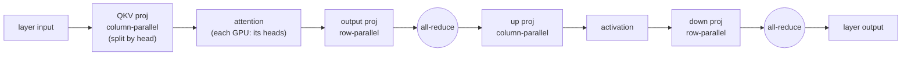

# Chapter 10 — Multi-GPU serving

## TL;DR

Some models don't fit on one GPU at any precision, and even when they fit, one GPU's memory bandwidth caps decode (Ch.01). Multi-GPU serving splits the work across devices, and there are three ways to cut it. **Tensor parallelism (TP)** shards every layer's weight matrices across GPUs — each GPU does a slice of every layer, and they combine with an all-reduce; this lowers per-GPU latency but demands a fast interconnect. **Pipeline parallelism (PP)** splits the layers themselves across GPUs — cheaper communication, but pipeline bubbles. **Expert parallelism (EP)** spreads a Mixture-of-Experts model's experts across GPUs. The crucial thing: inference parallelism is *not* training parallelism — no backward pass, no optimizer state, so TP-for-latency dominates where training leans on data parallelism and ZeRO. This chapter is how one forward pass becomes many GPUs' work, and how that interacts with the KV cache, batching, and kernels you've built.

---

## Why this matters

The choice of parallelism decides your latency, your cost, and whether the model runs at all. Get it wrong — TP across a slow interconnect, or PP with no micro-batching — and you can make a model *slower* on eight GPUs than on one. Get it right and you hit a latency SLO a single GPU could never reach, or serve a 400B model that fits nowhere else. And because TP shards the KV cache and PP interacts with continuous batching, the parallelism decision is entangled with everything from Ch.04 to Ch.08. This is where "just add GPUs" turns into a real engineering choice with a right and wrong answer per workload.

---

## The concept

### Two reasons to use more than one GPU

- **Capacity.** A 70B model in FP16 is ~140 GB of weights — more than a single 80 GB GPU holds, before the KV cache. Quantization (Ch.09) helps, but the largest models don't fit at any precision. You *must* split.
- **Latency.** Even when a model fits, one GPU's memory bandwidth sets the decode ceiling (Ch.01: `N·d / bandwidth`). Splitting the per-layer work across GPUs multiplies the aggregate bandwidth applied to each token, so each decode step is faster. This is the reason to use TP even when you don't have to.

### Tensor parallelism: split each layer across GPUs

Tensor parallelism shards the *weight matrices themselves*. Every GPU holds a slice of every layer, computes its slice, and the slices are combined by a collective. Both engines implement the classic Megatron structure — with the same class names:

```python
# Tensor parallelism: shard each layer's weights across TP ranks (Megatron-style).
# vllm/model_executor/layers/linear.py @ ae098ab   (SGLang's linear.py is structurally identical)

class ColumnParallelLinear(LinearBase):                              # L397 split the OUTPUT dimension
    self.output_size_per_partition = divide(output_size, self.tp_size)   # L441 each GPU holds 1/tp of the columns

class RowParallelLinear(LinearBase):                                # split the INPUT dimension; each GPU computes
    ...                                                             # a PARTIAL result over its shard, then:
    output = tensor_model_parallel_all_reduce(output_parallel)      # L1695 — sum the partials (SGLang: same call, linear.py L1557)
```

A **column-parallel** layer splits the output columns, so each GPU produces part of the output with no communication. A **row-parallel** layer splits the input rows, so each GPU computes a partial sum that must be **all-reduced** across GPUs to get the true result. That all-reduce is the cost of TP.

### The column-then-row trick: one all-reduce per block

Why two flavors? Because chaining a column-parallel layer into a row-parallel one means the intermediate stays sharded and you pay **exactly one all-reduce per block** instead of one per layer-half. In a transformer:

- **Attention:** QKV projection is column-parallel (it splits the *heads* across GPUs — each GPU owns a subset of attention heads), the output projection is row-parallel → one all-reduce.
- **MLP:** the up-projection is column-parallel, the down-projection is row-parallel → one all-reduce.

So a TP transformer layer costs **two all-reduces** (one after attention, one after the MLP), no matter how wide the layer. That's the minimum, and it's why the Megatron layout is universal.



The intermediate stays sharded across the column→row chain, so each half of the block pays exactly one all-reduce — two per layer, the sync points that must sit on a fast interconnect.

### TP demands a fast interconnect

Those all-reduces sit on the **critical path of every layer** — the GPUs cannot proceed until the collective finishes. For a deep model at decode, that's dozens of blocking collectives per token. So TP is only fast when the GPUs are joined by a high-bandwidth link (NVLink within a node). Run TP across PCIe or Ethernet and the all-reduces dominate — you spend more time communicating than computing. **Rule of thumb: TP within a node, never across nodes.**

### TP shards the KV cache too (Ch.04 tie)

Because the QKV projection is column-parallel *by head*, each TP rank owns a subset of the attention heads — and therefore a subset of the KV cache. Each GPU stores `1/tp` of the Ch.04 cache (`2 × n_layers × (n_kv_heads / tp) × head_dim × dtype`). So TP splits both the weights *and* the KV cache, which is a second capacity win: TP=8 gives you up to 8× the KV room (when `n_kv_heads ≥ tp`), not just 8× the weight room. (With GQA, `n_kv_heads` can be smaller than `tp`, which constrains how the few KV heads are shared or replicated across ranks — a real edge case worth knowing.)

### Pipeline parallelism: split the layers, not the matrices

Pipeline parallelism cuts the model the other way: assign **layer ranges** to GPUs (GPU 0 runs layers 0–15, GPU 1 runs 16–31, …). A request flows through the stages in sequence; only the **activations** pass between stages — a small point-to-point send, not a per-layer all-reduce. So PP communicates far less than TP and tolerates slower links, which is why PP is how you span **across nodes**.

The cost is **pipeline bubbles**: while GPU 0 works on the first stage, GPUs 1–3 sit idle until the activation reaches them, and vice versa at the end. You fill the bubble by pipelining many **micro-batches** through the stages at once — the more in flight, the higher the utilization. PP buys capacity across nodes at the price of scheduling complexity and some idle time.

### Expert parallelism: for Mixture-of-Experts

An MoE model (Ch.01, Ch.09) has many expert MLPs, only a few active per token. **Expert parallelism** places different experts on different GPUs; each token is routed (an all-to-all communication) to the GPU holding the expert it needs. This is how you scale MoE past one GPU's ability to hold all the experts, and it introduces a routing/all-to-all cost that TP and PP don't have. EP is usually combined with TP/PP in large MoE deployments.

### Inference parallelism is not training parallelism

This is the load-bearing distinction. Training uses **3D parallelism** (data + tensor + pipeline) plus ZeRO/FSDP to shard *gradients and optimizer states* — because the backward pass and the optimizer dominate training memory. **Inference has none of that**: no backward pass, no gradients, no optimizer state. So:

- **TP** is the primary inference lever, and its job is *latency* — split each layer so each token finishes sooner — bounded by the interconnect.
- **PP** is for *capacity* across nodes when TP within a node isn't enough.
- **Data parallelism** in inference just means **replicas** — independent copies of the model behind a load balancer (Ch.15), scaling throughput, not fitting a bigger model.

You choose TP degree to hit a latency target within a node, add PP to span nodes if the model still doesn't fit, add EP for MoE, and replicate (DP) for throughput. That decision tree is inference-specific and different from anything a training setup would pick.

### Two engines, one Megatron layout

Verified in both. **Agreement (load-bearing):** both shard tensor-parallel layers with the *same* `ColumnParallelLinear` / `RowParallelLinear` structure and a `tensor_model_parallel_all_reduce` to combine row-parallel partials — the Megatron pattern, class-name for class-name. Both support TP, PP, and EP, configured in `vllm/config/parallel.py` / SGLang's `server_args.py`. **Divergence (topology & comms, will rot):** the communication backends (NCCL and custom all-reduce kernels), how attention-data-parallelism and expert-parallelism are arranged, and the default TP/PP/EP degrees differ and evolve fast. The Megatron sharding is the stable concept; the exact collective implementation and parallel topology are what change.

---

## Real-system notes

- **vLLM** — `vllm/model_executor/layers/linear.py` @ `ae098ab` defines `ColumnParallelLinear` (L397, `output_size_per_partition = divide(output_size, tp_size)`) and `RowParallelLinear` with `tensor_model_parallel_all_reduce`; parallel degrees live in `vllm/config/parallel.py` (TP, PP, EP, plus data-parallel replicas). A custom all-reduce kernel is used for small TP messages on NVLink.
- **SGLang** — `python/sglang/srt/layers/linear.py` @ `52c6e27` mirrors it (`ColumnParallelLinear` L291, `RowParallelLinear` L1339, all-reduce at L1557); `server_args.py` exposes `--tp-size`, `--pp-size`, `--ep-size`, `--dp-size`, and it has extensive attention-data-parallel and expert-parallel support for large MoE.
- **Megatron-LM** (Shoeybi et al., 2019) is the origin of the column/row tensor-parallel layout both engines implement — the primary external reference for *why* the split is shaped this way.
- **llama.cpp** supports splitting a model across GPUs (layer split ≈ pipeline, tensor split ≈ TP) via `--split-mode`, a hands-on place to watch a model span devices on modest hardware.

---

## Common failure cases

*These failures are durable; their fixes evolve fastest — each names the pattern and leaves current specifics to you and your AI partner.*

- **TP across a slow interconnect.** Tensor-parallel all-reduces on PCIe/Ethernet make eight GPUs slower than one. *Fix: keep TP within an NVLink node; use PP to cross node boundaries (this chapter).*
- **Pipeline parallelism with no micro-batching.** PP without enough in-flight micro-batches leaves most GPUs idle in the bubble. *Fix: pipeline many micro-batches; size the count to the number of stages (this chapter).*
- **Applying a training parallelism plan to inference.** Reaching for ZeRO/FSDP or DP-first thinking wastes effort on gradients/optimizer state that inference doesn't have. *Fix: TP for latency, PP for cross-node capacity, replicas for throughput (this chapter).*
- **Forgetting TP shards the KV cache.** Sizing KV as if one GPU holds it all under-uses the aggregate capacity (or over-plans a single rank). *Fix: each rank holds `n_kv_heads/tp` of the cache; account for the split (Ch.04, this chapter).*
- **Over-sharding tiny models.** High TP degree on a small model makes communication dominate compute with no latency benefit. *Fix: use the smallest parallelism that fits and hits the SLO; measure the communication fraction (Ch.16).*

---

## Pair with your agent

- *"For my model and GPUs, compute whether it fits at TP=1/2/4/8 (weights + KV at my context/batch), and estimate the decode-latency change from the added aggregate bandwidth. Recommend a TP degree."*
- *"Explain the column-then-row trick: why QKV is column-parallel and the output projection row-parallel, and why that yields exactly one all-reduce per attention block."*
- *"Open `references/vllm/vllm/model_executor/layers/linear.py` and `references/sglang/.../layers/linear.py`. Show me `ColumnParallelLinear` splitting the output dim and `RowParallelLinear`'s all-reduce in BOTH, and confirm they're the same Megatron layout."*
- *"Benchmark TP within a node vs. across two nodes for my model and show me the communication fraction — prove why TP wants NVLink and PP crosses nodes."*
- *"My model is MoE — walk me through expert parallelism: how tokens route to expert GPUs and what all-to-all costs, and how EP combines with TP."*

---

## What's next

You've now scaled a single forward pass across precision (Ch.09) and across devices (Ch.10). That completes the *model-execution* story — the parts of serving that turn tokens into tokens as fast and as large as the hardware allows. The next block zooms out from one model to the **serving system** around it: Ch.11 is the **scheduler** — the control loop that decides, every step, which requests run, when prefill and decode interleave, and how the queue, the KV pool, and the batch you've built are actually orchestrated under real, bursty load.
