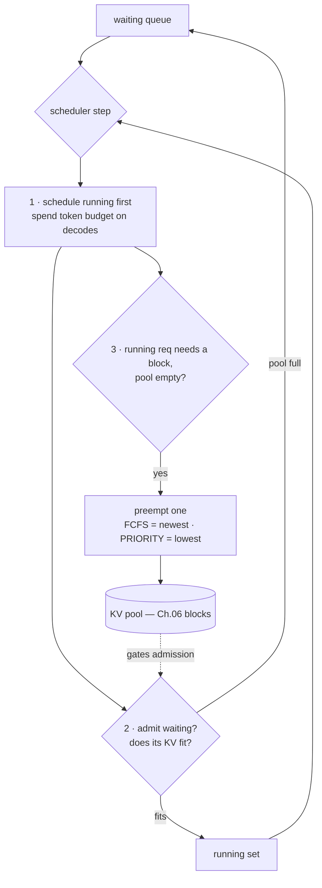

# Chapter 11 — The scheduler

## TL;DR

Ch.05 introduced continuous batching — reform the running set every step. The scheduler is the control plane that *decides* what that set is, under real, bursty load and a finite KV pool. Every step it does four things: **admit** waiting requests only if their KV will fit, **schedule** the running set within a token budget (decodes first, then prefill), **preempt** running requests when the pool can't grow them, and enforce **policy** (FCFS, priority, SLOs). Two patterns dominate the modern scheduler: **chunked prefill**, which splits big prompts so they don't stall decodes, and **prefill/decode disaggregation**, which runs the compute-bound prefill phase on different workers than the memory-bound decode phase to stop them from interfering. This chapter is where the queue, the KV pool, the batch, and the two regimes you've built all get orchestrated — and where a serving stack's tail latency is won or lost.

---

## Why this matters

The scheduler is the single component that turns a fast model into a fast *service*. A model can have a perfect kernel and a paged cache and still deliver terrible p99 latency if the scheduler admits a giant prefill that freezes every in-flight decode, or thrashes on preemption because it over-admitted. Everything upstream (Ch.01–10) makes one forward pass fast; the scheduler decides *whose* forward pass runs *when*, which is what your users actually feel. It's also where your SLOs live: TTFT and TPOT are scheduling outcomes, not model properties. Get the scheduler right and the same GPUs serve more users at lower tail latency; get it wrong and no kernel can save you.

---

## The concept

### The scheduler is a control loop over a finite pool

Every step, the scheduler looks at three things — the **waiting queue** (new requests), the **running set** (in-flight requests), and the **KV pool** (Ch.06's blocks) — and decides who computes. It's a control loop enforcing hard constraints (KV capacity, a per-step token budget) and soft ones (priorities, deadlines). Ch.05 told you the batch reforms every step; Ch.11 is *how that decision is made* when the pool is full and the queue is deep.

### The step: admit, schedule, preempt

Concretely, one scheduler step (following vLLM's `Scheduler.schedule`):

1. **Schedule the running set first.** Each running request contributes ~1 decode token; spend the token budget on them first so in-flight work keeps advancing (protecting TPOT).
2. **Admit waiting requests with the leftover budget** — *if their KV fits*. A waiting request's prefill needs blocks (Ch.06); if the pool can't provide them, it stays queued. This is **admission control**, and it's what prevents the pool from overflowing.
3. **Preempt if a running request can't grow.** A decoding request occasionally needs a *new* block (its current one filled). If the pool is empty, someone must be evicted.



### Admission control: does the KV fit?

The load-bearing gate is simple to state and easy to get wrong: **never admit a request whose KV you can't allocate.** Because prefill writes the whole prompt's KV up front (Ch.04), admitting a 10k-token prompt means reserving ~10k tokens of blocks *now*. An over-eager scheduler that admits everything OOMs or preempts constantly; a timid one leaves the GPU idle. The scheduler's quality is largely how well it walks this line — keeping the pool near full without tipping over.

### Preemption: FCFS vs. priority

When a running request needs a block and the pool is empty, the scheduler evicts one — and *which* one is a policy:

```python
# vLLM — preemption when the KV pool can't grow a running request.
# vllm/v1/core/sched/scheduler.py @ ae098ab  (Scheduler.schedule)

if new_blocks is not None:                          # L541 got a block → this request is scheduled
    break
# L545 the request could NOT be allocated a block → preempt to free KV:
if self.policy == SchedulingPolicy.PRIORITY:        # L547
    preempted_req = max(self.running,               # L548 evict the LOWEST-priority (latest-arrival) request
        key=lambda r: (r.priority, r.arrival_time))
else:                                               # FCFS:
    preempted_req = self.running.pop()              # L572 evict the most-recently-admitted request (LIFO)
self._preempt_request(preempted_req, ...)           # L574 free its KV; the request resumes later
```

Under **FCFS**, the newest request is preempted (LIFO) so older requests finish first. Under **PRIORITY**, the lowest-priority request yields to higher-priority ones. Preemption is the pressure-release valve that lets the scheduler admit optimistically without crashing — but it isn't free, which is the next point.

### Recompute vs. swap: two ways to preempt

A preempted request's KV has to go somewhere:

- **Recompute** — drop the KV entirely; when the request resumes, re-run its prefill to rebuild it. Costs *compute* on resume, but frees the memory immediately and needs no extra bandwidth.
- **Swap** — copy the KV out to CPU RAM, copy it back on resume. Costs *PCIe bandwidth* both ways, but avoids recomputation.

The choice is a compute-vs-bandwidth trade, and it depends on prompt length (long prompts are expensive to recompute) and interconnect. Either way, frequent preemption is a symptom of over-admission — a signal to admit less, not a normal steady state.

### Chunked prefill: don't let a prompt freeze decode

Prefill and decode fight for the same step. A single 8k-token prefill would consume the entire token budget, so every in-flight decode stalls that step — a TTFT win for the new request paid for by a TPOT spike for everyone else. **Chunked prefill** splits a long prompt across several steps, prefilling a slice at a time while decodes keep flowing. It's the scheduler's tool for smoothing the prefill/decode interference within a single GPU — trading a slightly slower prefill for stable decode latency.

### Prefill/decode disaggregation: separate the regimes entirely

Chunked prefill *interleaves* the two regimes; disaggregation *separates* them. Recall the asymmetry: prefill is compute-bound and bursty (one big pass), decode is memory-bound and steady (many small passes). Running them on the same GPU means a prefill spike always disturbs decode latency, no matter how you chunk. **Prefill/decode disaggregation** runs prefill on one pool of workers and decode on another, transferring the KV cache from the prefill worker to the decode worker when the prompt is done. Each pool is tuned for its regime (prefill workers for throughput, decode workers for latency), and neither interferes with the other. The cost is a **KV transfer** across the interconnect between phases. Both engines support it — vLLM through a KV-connector (`distributed/kv_transfer/`), SGLang through a dedicated `disaggregation/` subsystem (`prefill.py` / `decode.py`) — and it is the dominant pattern in large-scale, latency-sensitive deployments.

### Policy: priorities, SLOs, and fairness

Above the mechanics sits policy. The scheduler is where you express: **priority** (a paid tier preempts a free one), **SLO-awareness** (favor requests near their deadline), and **fairness** (no single tenant starves the others — critical for the multi-tenant systems of Ch.15). These are the same admission/preemption levers pointed at business goals: which requests to admit when the pool is scarce, and which to evict under pressure. The scheduler is the one place in the stack where "how the service should behave" becomes code.

### Two engines, one control plane

Verified in both. **Agreement (load-bearing):** both run a per-step scheduler that schedules the running set within a token budget, admits waiting requests gated by KV capacity, preempts when the pool is exhausted, chunks long prefills, and supports prefill/decode disaggregation. vLLM: `Scheduler.schedule` with `SchedulingPolicy` (FCFS/PRIORITY) and `distributed/kv_transfer/`. SGLang: its `Scheduler` with `get_next_batch_to_run` and a `disaggregation/` subsystem. **Divergence (policy & transport, will rot):** the exact preemption policies, admission heuristics, chunked-prefill thresholds, and KV-transfer transports differ and change every release. The control-loop *shape* — admit-under-KV, schedule-in-budget, preempt-under-pressure, disaggregate-the-regimes — is the durable concept.

---

## Real-system notes

- **vLLM** — `vllm/v1/core/sched/scheduler.py` @ `ae098ab`: `Scheduler.schedule` with a `token_budget`, running-first then waiting admission (L636), a `SchedulingPolicy` enum (FCFS / PRIORITY) driving preemption (L546–574), and chunked prefill via a long-prefill threshold. Disaggregation lives in `vllm/distributed/kv_transfer/` (a pluggable KV-connector in `kv_connector/`, plus a documented disaggregated-prefill workflow).
- **SGLang** — `python/sglang/srt/managers/scheduler.py` @ `52c6e27` (`get_next_batch_to_run`, `running_batch`) plus a full `disaggregation/` subsystem (`prefill.py`, `decode.py`, `decode_kvcache_offload_manager.py`) — reflecting how central disaggregation and KV offload have become at scale.
- **Orca** (2022) and the **Sarathi / chunked-prefill** and **DistServe / Splitwise** (2023–24) lines are the external references for iteration-level scheduling, chunked prefill, and prefill/decode disaggregation respectively — worth reading for *why* each pattern exists.

---

## Common failure cases

*These failures are durable; their fixes evolve fastest — each names the pattern and leaves current specifics to you and your AI partner.*

- **Over-admission → preemption thrash.** Admitting more than the KV pool can hold makes the scheduler evict and re-run constantly, burning throughput. *Fix: admission control that reserves KV before admitting; treat preemption rate as a health metric (this chapter, Ch.16).*
- **A long prefill spiking decode latency.** One big prompt consumes the step and stalls every in-flight decode. *Fix: chunked prefill; or disaggregate prefill from decode entirely (this chapter).*
- **Ignoring the prefill/decode interference.** Co-locating bursty prefill with steady decode on one GPU makes TTFT and TPOT fight. *Fix: chunk within a GPU, or disaggregate across worker pools when latency SLOs are tight (this chapter).*
- **No priority under load.** FCFS-only scheduling can't protect a paid tier or a deadline-critical request when the pool is scarce. *Fix: a priority/SLO-aware policy on the same admit/preempt levers (this chapter).*
- **Preempting by recompute for very long prompts.** Dropping and rebuilding a huge KV wastes compute on resume. *Fix: choose swap-vs-recompute by prompt length and interconnect (this chapter).*

---

## Pair with your agent

- *"Drive my server past its KV capacity and watch the scheduler: log preemption events and per-request TTFT/TPOT, and show me how admission and preemption respond as load climbs."*
- *"Open `references/vllm/vllm/v1/core/sched/scheduler.py` and walk me through one `schedule()` step: running-first, waiting admission gated by KV, and the FCFS-vs-PRIORITY preemption at L546–574."*
- *"Turn chunked prefill on and off with a long-prompt workload mixed with short decodes. Measure the TPOT spike without it and the smoothing with it."*
- *"Explain prefill/decode disaggregation: why the two regimes interfere, what the KV transfer costs, and when disaggregation beats chunked prefill. Point me at `references/vllm/vllm/distributed/kv_transfer/` and `references/sglang/.../disaggregation/`."*
- *"Simulate recompute vs. swap preemption for a 200-token and a 8k-token prompt on my interconnect, and tell me which wins for each and why."*

---

## What's next

The scheduler decides *who* runs; the next chapter makes each run *cheaper* by not repeating work. Ch.12 is **prefix caching** — when many requests share a prefix (a long system prompt, a common few-shot preamble, a chat history), the KV for that prefix can be computed once and reused across all of them, turning Ch.06's block sharing into a major latency and capacity win. It's SGLang's RadixAttention and vLLM's automatic prefix caching, and it's the direct payoff of the paged, block-addressed cache you built in Ch.06.
