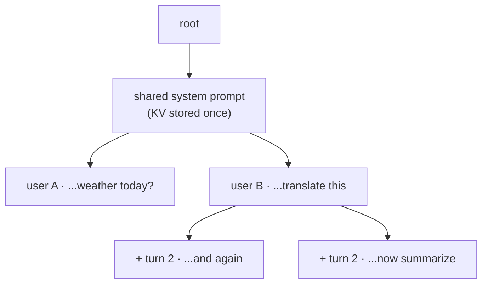

# Chapter 12 — Prefix caching

## TL;DR

Ch.06 made the KV cache block-addressed and shareable; this chapter cashes that in. Real workloads repeat prefixes constantly — a long system prompt in front of every request, a few-shot preamble, a chat history re-sent every turn, an agent loop reusing the same context. The KV for a shared prefix is *identical* across all those requests (same tokens → same keys and values, Ch.04), so it can be computed **once** and reused. Prefix caching detects the match and prefills only the *uncached suffix*, collapsing time-to-first-token for prompt-heavy traffic and freeing the KV that duplicate prefixes would have wasted. vLLM does it by hashing blocks and looking up matches; SGLang does it with **RadixAttention** — a radix tree of cached prefixes. It is the single biggest win for the workloads people actually run, and it is a direct payoff of the paged cache you built in Ch.06.

---

## Why this matters

Prompt reuse is the rule, not the exception. Every chat turn re-sends the entire conversation; every request to an assistant carries the same multi-thousand-token system prompt; every RAG or agent step shares a fixed preamble. Without prefix caching you re-prefill that shared context on every single request — the most wasteful thing a serving stack can do, because prefill is the compute-heavy phase (Ch.01) and the duplicated KV is the scarce resource (Ch.04). Turn prefix caching on and a 2,000-token system prompt shared across a thousand requests is prefilled once instead of a thousand times, and stored once instead of a thousand times. That is often a larger, cheaper win than any kernel or quantization — and it costs the user nothing but enabling it.

---

## The concept

### The repeated-prefix opportunity

Two requests that begin with the same tokens produce the same KV for those positions — attention is causal, so a token's keys and values depend only on itself and what precedes it (Ch.04). If request B starts with the exact prefix request A already computed, B's KV for that prefix is *bit-identical* to A's. Recomputing it is pure waste. The opportunity is enormous because prefixes repeat structurally:

- **System prompts** — the same instructions in front of every request.
- **Few-shot preambles** — a fixed set of examples before the real query.
- **Chat history** — turn *n* re-sends turns *1…n-1*, a strictly growing shared prefix.
- **Agent / RAG context** — a stable tool list, schema, or retrieved passage reused across steps.

### Prefix caching: compute the prefix once

The mechanism: when a request arrives, detect the longest prefix whose KV is already cached, **reuse** those blocks, and prefill only the tokens past the match. TTFT drops from "prefill the whole prompt" to "prefill the new suffix" — for a chat turn that adds 20 tokens to a 4,000-token history, that's prefilling 20 tokens instead of 4,020. The reused KV is exactly the block-addressed cache from Ch.06; prefix caching is the policy that decides which blocks a new request can point at instead of allocating fresh.

### vLLM: automatic prefix caching by block hash

vLLM hashes the content of each full block (Ch.06's `cached_block_hash_to_block`) and, on a new request, finds the longest run of blocks whose hashes it already holds:

```python
# vLLM — automatic prefix caching: reuse cached blocks matching the request's prefix, by content hash.
# vllm/v1/core/kv_cache_manager.py @ ae098ab  (KVCacheManager.get_computed_blocks)

computed_blocks, num_new_computed_tokens = self.coordinator.find_longest_cache_hit(  # L228–232
    request.block_hashes, max_cache_hit_length)   # longest run of already-cached blocks, matched by CONTENT HASH
# → only the uncached suffix is prefilled; the shared prefix's KV comes from Ch.06's cached_block_hash_to_block.
```

It's **block-granular**: matches land on block boundaries (multiples of `block_size`), and it's automatic — no API, just a hash lookup on every request. (One subtlety the source notes: even on a full cache hit, the *last* token must be recomputed to produce logits, so the hit length is capped at `num_tokens − 1`.)

### SGLang: RadixAttention — a radix tree of prefixes

SGLang generalizes this with **RadixAttention**: cached prefixes live in a radix tree (a compressed trie) whose edges are token runs and whose nodes hold the KV for those tokens.

```python
# SGLang — RadixAttention: cached prefixes live in a RADIX TREE of token runs → KV.
# sglang/.../mem_cache/radix_cache.py @ 52c6e27  (TreeNode, RadixCache.match_prefix)

class TreeNode:                              # L217
    self.children = defaultdict(TreeNode)    # L222 tree edges keyed by token runs (a trie / radix tree)
    self.key: RadixKey                       # L224 the token sequence on this node
    self.value: torch.Tensor                 # L225 the cached KV indices for those tokens
    self.lock_ref = 0                        # L226 pin in-use prefixes so they aren't evicted
    self.last_access_time = ...              # L227 LRU eviction timestamp

def match_prefix(self, params) -> MatchResult:   # L355 walk the tree → longest cached prefix for a request
```

The tree structure buys flexibility the block-hash approach doesn't have: many requests that share a system prompt but diverge afterward all share the *trunk* of the tree and branch at the point they differ, so the shared prefix is stored once and every branch reuses it. RadixAttention is SGLang's signature contribution, and it makes prefix reuse first-class for branching, multi-turn, and agentic workloads.



Every request that shares the trunk reuses its KV; a new turn just extends a leaf. Block-hash caching (vLLM) reuses the same shared prefix too, but only in whole `block_size` chunks — the tree's extra gift is matching at token granularity and reusing *partial* prefixes.

### Why the win is huge (Ch.01 and Ch.04, together)

Prefix caching hits *both* halves of the cost model at once, which is rare:

- **Compute / TTFT (Ch.01).** A shared 2,000-token prefix across 1,000 requests is 2,000 tokens of prefill instead of 2,000,000. Prefill is the compute-bound phase, so this is a direct, large FLOP and latency saving.
- **Memory / capacity (Ch.04).** That prefix's KV is stored *once* and pointed at by all 1,000 requests, instead of 1,000 private copies. The Ch.04 formula's cost is paid a single time for the shared span — which frees enormous KV capacity, raising the batch size Ch.05 can sustain.

Almost every other technique in this course trades one for the other; prefix caching improves both, for free, on workloads that repeat.

### Eviction: LRU on cached prefixes

Cached prefixes that no active request is using are **evictable** — and both engines evict least-recently-used when the pool needs room (SGLang's `last_access_time` on each `TreeNode`; vLLM's free-but-cached blocks in Ch.06's eviction-ordered free queue). A prefix that stays hot (a popular system prompt) survives; a one-off prefix ages out. This is why Ch.06 kept its free list in *eviction order*: it's the machinery that lets prefix caching hold hot prefixes while reclaiming cold ones under pressure.

### Correctness: exact match and reference counting

Two disciplines keep it safe. **Exact match:** the prefix must be identical token-for-token (and position-for-position) — vLLM guards this with content hashes, SGLang with the tree keys; a mismatch would reuse *wrong* KV, a silent correctness bug far worse than a slow one. **Reference counting:** a shared block must not be freed while a request is still using it — SGLang's `lock_ref` pins in-use nodes, and Ch.06's copy-on-write ref counts do the same for blocks. Sharing without ref-counting corrupts every request pointing at the block.

### The catch: it only helps when prefixes repeat

Prefix caching is close to free when it misses (a hash lookup or a tree walk) and enormous when it hits — but it only hits when prefixes actually repeat. All-unique prompts (say, a batch of unrelated one-off completions) get nothing but the small bookkeeping cost. So the win is workload-shaped: massive for chat, agents, RAG, and shared-system-prompt serving; negligible for high-entropy, no-shared-context traffic. Know which you have before you credit it for your throughput.

### Two engines, one payoff

Verified in both. **Agreement (load-bearing):** both do *automatic* prefix caching — detect the longest already-computed prefix, reuse its KV blocks, prefill only the suffix, evict LRU, and ref-count shared blocks for safety. Both are built directly on Ch.06's block-addressed cache. **Divergence (the crown-jewel difference, will evolve):** vLLM matches by **block content hash** (`find_longest_cache_hit` over `request.block_hashes`) — simple and block-granular; SGLang matches via a **radix tree** (`match_prefix`) — more flexible for branching and partial-prefix reuse. The *idea* — compute a shared prefix once and reuse it — is the durable concept; block-hash vs. radix-tree is the implementation that distinguishes the engines.

---

## Real-system notes

- **vLLM** — automatic prefix caching in `vllm/v1/core/kv_cache_manager.py` @ `ae098ab` (`get_computed_blocks` → `find_longest_cache_hit` over `request.block_hashes`, L228), built on `block_pool.py`'s `cached_block_hash_to_block` (Ch.06). On by default; block-granular; hash-based.
- **SGLang** — RadixAttention in `python/sglang/srt/mem_cache/radix_cache.py` @ `52c6e27` (`TreeNode` L217, `RadixCache.match_prefix` L355, `insert` L415, `evict` L563): a radix tree of token runs → KV with `lock_ref` pinning and `last_access_time` LRU. The signature feature of the SGLang paper (Zheng et al., 2024).
- **Beyond a single GPU** — prefix caching also drives *routing*: a gateway can send a request to whichever replica already holds its prefix (cache-aware load balancing, Ch.15), turning a local cache into a cluster-wide one. Both projects have work here; it's the fastest-moving frontier of the idea.

---

## Common failure cases

*These failures are durable; their fixes evolve fastest — each names the pattern and leaves current specifics to you and your AI partner.*

- **Leaving prefix caching off for prompt-heavy traffic.** Re-prefilling the same system prompt or chat history every request wastes the most compute in the whole stack. *Fix: enable automatic prefix caching; it's close to free on a miss and huge on a hit (this chapter).*
- **Non-deterministic prefixes defeating the cache.** Injecting a timestamp, request-id, or random token *before* the shared content breaks the match on every request. *Fix: put variable content after the stable prefix so the shared span stays byte-identical (this chapter).*
- **Cache-oblivious routing across replicas.** A gateway that spreads requests round-robin lands a repeated prefix on a different replica each time, so it never hits. *Fix: cache-aware routing — send a prefix to the replica that holds it (Ch.15).*
- **Trusting a match without exact-match discipline.** Reusing KV for a prefix that isn't truly identical is a silent correctness bug. *Fix: rely on the engine's content-hash / tree-key match; never hand-roll prefix reuse (this chapter).*
- **Evicting hot prefixes under pressure.** A poor eviction policy drops a popular system prompt and re-prefills it repeatedly. *Fix: LRU with in-use pinning (`lock_ref`); watch cache hit-rate as a metric (Ch.16).*

---

## Pair with your agent

- *"Measure prefix caching on a chat workload: send a growing multi-turn conversation with caching off vs. on, and show me TTFT per turn and the total prefill tokens saved."*
- *"Compute the KV capacity freed by sharing a 2,000-token system prompt across 500 concurrent requests, using the Ch.04 formula — one copy vs. 500."*
- *"Open `references/vllm/vllm/v1/core/kv_cache_manager.py` (`get_computed_blocks`) and `references/sglang/.../radix_cache.py` (`TreeNode`, `match_prefix`). Show me the block-hash match in one and the radix-tree walk in the other, and explain what the tree does that block-hash can't (sub-block / token-granular prefix matching — block-hash only matches on `block_size` boundaries; both already support branching)."*
- *"Break my cache on purpose: prepend a timestamp to each prompt and show the hit rate collapse, then move the timestamp after the system prompt and watch it recover."*
- *"Explain RadixAttention's `lock_ref` and `last_access_time`: how in-use pinning and LRU eviction coexist so a hot prefix survives but a cold one is reclaimed."*

---

## What's next

Prefix caching made repeated *input* cheap. The next chapter constrains the *output*: Ch.13 is **structured / constrained decoding** — forcing the model's tokens to conform to a JSON schema, a grammar, or a regex by masking the logits at each step (Ch.01's sampler, now with a constraint). It's how tool-calling and structured extraction are made reliable, and it composes with everything you've built: the sampler from Ch.01, the loop from Ch.02, and the batched, cached serving path from Ch.04–12.
