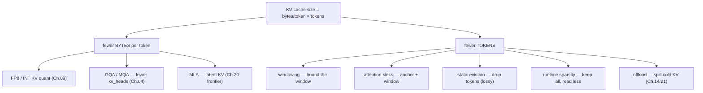

# Chapter 14.5 — KV compression and eviction

## TL;DR

Ch.04 gave you the KV-cache formula and Ch.14 showed it becomes the entire memory budget at long context. There are only two ways to shrink it: **fewer bytes per token** (quantization, Ch.09 — FP8/INT KV) or **fewer tokens** (this chapter). The token-count axis splits into four moves: **windowing** (only ever attend to a fixed window — sliding-window attention), **attention sinks** (keep the first few tokens forever, because softmax needs an anchor, then slide a window), **static eviction** (permanently drop tokens judged unimportant — H2O, SnapKV; lossy), and **runtime sparsity** (keep *all* KV but *read* only the pages relevant to the current query — Quest, DeepSeek-DSA; near-lossless). The honest production picture: engines ship windowing, sinks, and FP8-KV, with query-aware sparsity newly in SGLang; H2O/SnapKV/InfLLM are still mostly research. Reach for these only when the KV wall (Ch.14) is real; below ~32k tokens they cost accuracy for memory you didn't need.

---

## Why this matters

At 128k context one request's KV can exceed the model weights (Ch.14). Quantizing the KV to FP8 (Ch.09) halves it once; after that the only lever left is *storing or reading fewer tokens*. Every technique here is a bet that most of the past doesn't matter for the next token — which is empirically true (a small fraction of tokens carry most of the attention mass) but *conditionally* true, and the failure mode is silent: drop the wrong token and quality degrades with no error raised. So this is a chapter about a trade you must measure, not assume. It's also where the "name ≠ implementation" discipline pays off hardest: the literature is a zoo of named methods, and very few of them are actually in the engine you're running.

---

## The concept

### Two axes: bytes per token vs. number of tokens

The KV formula `2 · n_layers · n_kv_heads · head_dim · dtype_bytes · n_tokens` (Ch.04) has exactly two shrinkable groups:



Chapters 04/09/20 own the left branch. This chapter owns the right one (minus offload, which is Ch.14/21).

### Windowing: the architectural answer

The cheapest way to bound KV is to never grow it: **sliding-window attention** makes each token attend only to the last `W` tokens, so KV is capped at `W` regardless of sequence length. It's a *model architecture* choice (Mistral, Gemma's local layers), not a serving trick — but the serving engine has to represent it. vLLM carries it as a first-class KV-cache spec: the `SLIDING_WINDOW` type (`vllm/v1/kv_cache_interface.py` L89) and a dedicated `SlidingWindowSpec` with a `sliding_window: int` field (L518–519). The catch: a pure window *forgets* — anything older than `W` is gone, which is fine for local coherence and fatal for long-range recall. That limitation is exactly what attention sinks fix.

### Attention sinks: why you keep the first tokens forever

Naively, a sliding window should just drop the oldest token each step. In practice, dropping the *very first* tokens collapses quality — and the reason is softmax, not semantics. Softmax attention must distribute a total weight of 1 across the sequence; when no past token is truly relevant, the model dumps the leftover mass onto the first few positions (the "**attention sinks**", StreamingLLM). Evict those and the mass has nowhere to go, destabilizing every later distribution. The fix: **keep the first `N` tokens (the sinks) permanently, plus a sliding window of recent tokens.** vLLM ships this as `SinkFullAttentionSpec` with a `sink_len` field (`vllm/v1/kv_cache_interface.py` L730–731; the `SINK_FULL_ATTENTION` spec type at L93); SGLang's FlashAttention-3 kernel takes a `sinks` argument. This is the one "keep less KV" method that is unambiguously in production — partly because GPT-OSS-class models use *learned* sinks.

### Static eviction: drop tokens you judge unimportant (lossy)

The research menu proper starts here. **Static eviction** permanently discards KV entries judged unimportant, so the cache stays small but the dropped tokens are *gone*:

- **H2O (Heavy-Hitter Oracle):** a small set of "heavy hitter" tokens accumulate most attention weight; keep those plus a recent window, evict the rest. Paper-reported ~cache↓ with small quality loss on long-generation tasks.
- **SnapKV:** at the *end of prefill*, use the last few tokens' attention pattern (an "observation window") to vote on which prompt tokens to keep, compressing the prompt KV before decode even starts.

Both are **lossy** — they bet the evicted token is never needed again, which fails on tasks that reference arbitrary earlier context (retrieval, long multi-hop). And critically: **neither is in the pinned vLLM/SGLang core.** (Watch the trap — vLLM has an `h2ovl.py`, but that is the *H2OVL vision-language model*, not H2O eviction; a matching name is not a matching mechanism.) Teach them as the literature; don't assume your engine runs them.

### Runtime sparsity: keep all KV, read less (near-lossless)

The more production-friendly idea keeps *every* token in the cache but, at each decode step, *reads* only the KV pages likely to matter for the current query. Nothing is dropped, so nothing is permanently lost — you trade a small approximation in *which* pages to read for a large cut in HBM traffic (Ch.0.5: decode is bandwidth-bound, so reading fewer bytes is the whole game).

This is the one eviction-family idea SGLang actually ships, as a pluggable registry:

```python
# SGLang — KV sparsity is a pluggable registry; what ships at this pin is Quest + DeepSeek-DSA.
# python/sglang/srt/mem_cache/sparsity/factory.py @ 52c6e27
{
    "quest":        lambda config, device, **kw: QuestAlgorithm(config, device, **kw),        # L24
    "deepseek_dsa": lambda config, device, **kw: DeepSeekDSAAlgorithm(config, device, **kw),  # L25
}
# QuestAlgorithm — "query-aware page selection … maintains per-dimension min/max of keys
# and uses them to upper-bound attention scores without" reading every page.
#   (mem_cache/sparsity/algorithms/quest_algorithm.py:5-6, class @ L21; page_k_min/page_k_max @ L26-27)
```

**Quest** keeps a per-page bounding box (min/max of the keys in each KV page); for the current query it upper-bounds each page's max possible attention score from that box, picks the top-scoring pages, and attends only to those. It's the paged block table of Ch.06 reused as a *skip list*. **DeepSeek-DSA** (Sparse Attention) is the second registered algorithm. This is genuinely in the engine — behind a `SparseCoordinator` and a `factory` dict-dispatch — which is exactly the "variant registry" shape the whole stack favors.

### External memory: the extreme-context answer

For million-token context, even sparse reading of a full cache is too much. **InfLLM** (and the retrieval-augmented family) push cold KV into an external memory of "blocks" and retrieve only the top-k relevant blocks per step — attention as nearest-neighbor lookup over a KV store. Powerful, still research, and adjacent to the KV-offload tiering of Ch.14/Ch.21 (the difference is *retrieval* vs. *paging* as the fetch policy).

### The honest production picture

Line up what's *shipped in the pinned engines* against what's *in the papers*:

| Technique | In pinned engine? | Lossy? |
|---|---|---|
| Sliding-window attention | ✅ vLLM `SLIDING_WINDOW` | forgets past window |
| Attention sinks | ✅ vLLM `SinkFullAttentionSpec`, SGLang FA `sinks` | near-lossless |
| FP8/INT KV quant (Ch.09) | ✅ both (`kv_cache_dtype`) | low, tunable |
| Query-aware sparsity (Quest / DeepSeek-DSA) | ✅ SGLang `mem_cache/sparsity/` | near-lossless |
| H2O / SnapKV (static eviction) | ❌ paper-only | yes |
| InfLLM (external memory) | ❌ paper-only | approximate |

The durable lesson: *most* KV-eviction research is not in the engine you run; what production reaches for first is windowing + sinks + FP8-KV, with query-aware sparsity the rising fourth. Ask your agent what your specific engine and model support today — the menu moves.

### When to reach for it — and when not

These techniques earn their accuracy risk only when KV is the binding constraint. Below roughly 32k tokens the KV cache is not your problem (batch size and bandwidth are), and lossy eviction there spends quality on memory you had to spare. The order of escalation: FP8 KV (Ch.09) → sinks/window if the model supports it → query-aware sparsity → offload (Ch.14/21) → static eviction only if you've measured the quality hit on *your* task and can live with it.

---

## Real-system notes

- **vLLM** — `vllm/v1/kv_cache_interface.py` @ `ae098ab` types the KV cache by attention shape: `FullAttentionSpec`, `SlidingWindowSpec` (`SLIDING_WINDOW` L89, `sliding_window: int` field L519), and `SinkFullAttentionSpec` (`sink_len` L731, `SINK_FULL_ATTENTION` L93). Eviction/sparsity of the H2O/Quest kind is *not* in core at this pin — sizing follows the model's attention type, not a token-dropping policy.
- **SGLang** — `python/sglang/srt/mem_cache/sparsity/` @ `52c6e27` is a real query-aware-sparsity subsystem: a `factory` registering `quest` → `QuestAlgorithm` and `deepseek_dsa` → `DeepSeekDSAAlgorithm` (L24–25), a `SparseCoordinator`, and a `BaseSparseAlgorithm` interface. Quest maintains per-page key min/max bounding boxes (`quest_algorithm.py`) to skip low-relevance pages.
- **The papers** (external, not in the pinned repos): H2O (Zhang et al., NeurIPS 2023), SnapKV (Li et al., 2024), StreamingLLM/attention sinks (Xiao et al., ICLR 2024), Quest (Tang et al., ICML 2024), InfLLM (Xiao et al., 2024). Cite these for the mechanism; ask your agent which, if any, your engine has adopted since this pin.

---

## Common failure cases

*These failures are durable; their fixes evolve fastest — each names the pattern and leaves current specifics to you and your AI partner.*

- **Enabling lossy eviction at short context.** Turning on H2O/SnapKV-style dropping when KV was never the bottleneck spends accuracy for nothing. *Fix: only compress when the KV wall is real (>~32k or a tight memory budget); measure quality on your task first (this chapter, Ch.14).*
- **Assuming your engine runs the paper.** Reading about H2O/Quest and believing your stack does it. *Fix: trace it — most eviction methods are not in core engines; confirm the algorithm is registered (e.g. SGLang's sparsity factory) before relying on it (this chapter).*
- **Name-matching a mechanism.** Seeing `h2ovl` and concluding vLLM implements H2O. *Fix: open the file — `h2ovl.py` is a vision-language model, not eviction. A matching name is not matching code (Ch.13's lesson, again).*
- **Evicting the sinks.** A naive sliding window that drops the first tokens destabilizes softmax and tanks quality. *Fix: keep the sink tokens (attention-sink / StreamingLLM); slide only the recent window (this chapter).*
- **Confusing "keep less" with "read less".** Treating query-aware sparsity (Quest) as lossy eviction. *Fix: sparsity keeps all KV and skips *reading* irrelevant pages (near-lossless); eviction *drops* KV (lossy). Different risk profiles (this chapter).*

---

## Pair with your agent

- *"For my model and engine, tell me which KV-reduction methods are actually supported today — sliding window, attention sinks, FP8 KV, query-aware sparsity — and which are paper-only. Cite the code or docs, don't guess."*
- *"Write a script that measures decode HBM traffic and quality (perplexity or a task metric) with and without FP8 KV at 8k / 32k / 128k context, so I can see where compression starts paying off."*
- *"Explain the attention-sink result: force a sliding window that drops the first tokens vs. one that keeps 4 sink tokens, and show me the quality difference on a long input."*
- *"Walk me through SGLang's `mem_cache/sparsity/` Quest algorithm — how the per-page min/max bounding box upper-bounds a page's attention score — and estimate the bandwidth saved at my context length."*
- *"For my workload (chat / RAG / long-doc), which KV technique is the right first move, and what quality metric should I watch to catch a bad eviction?"*

---

## What's next

You've now exhausted the ways to make the KV cache smaller — fewer bytes (Ch.09), fewer heads (Ch.04), fewer tokens (this chapter), or spilled to another tier (Ch.14/21). That closes the memory story. Ch.15 changes altitude: from making one engine fast to making it a **service** — the process split, the API layer, horizontal replicas, and cache-aware routing that turns a fast engine into a fast, multi-tenant, always-on system.
