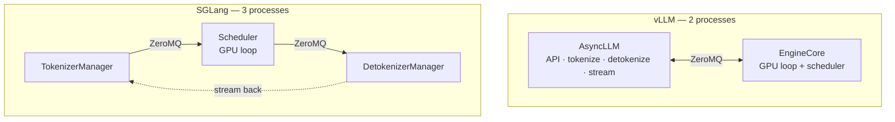

# Chapter 15 — Backend infrastructure

## TL;DR

Chapters 01–14 built an *engine* — a process that turns tokens into tokens as fast as the hardware allows. This chapter turns that engine into a *service*: something that survives real traffic, many users, and running around the clock. The load-bearing architectural move is a **process split** — the API/tokenizer front end runs in a *different process* from the GPU engine loop, connected by IPC, so that HTTP parsing, tokenization (Ch.03), and detokenization (Ch.02) never block the GPU. On top of that sit the pieces that make it a real system: an OpenAI-compatible streaming API, a request queue with backpressure, **horizontal scale** (many engine replicas behind a router), **cache-aware routing** that sends a request to the replica already holding its prefix (Ch.12), and **multi-tenancy** with the scheduler (Ch.11) enforcing fairness. This is where a fast engine meets operational reality.

---

## Why this matters

An engine that hits 3,000 tokens/sec on a benchmark is worthless if it drops requests under a traffic spike, blocks the GPU while parsing JSON, or can't scale past one machine. The gap between "fast in a loop" and "fast as a 24/7 multi-user service" is exactly this chapter. It's also where the cost of your whole stack is realized or wasted: a well-designed backend keeps every GPU saturated and routes requests to reuse caches; a poorly designed one leaves GPUs idle waiting on the CPU and re-prefills the same prompts on different replicas. Understanding the service layer is understanding why two deployments of the *same* engine can differ 3× in cost per request.

---

## The concept

### From engine to service

The engine is a single process running the loop (Ch.02) over a batch (Ch.05) on a GPU. A *service* wraps it with everything production needs: an HTTP API clients can call, admission and queueing under load, streaming responses, horizontal scale across GPUs and machines, isolation between tenants, and the health/restart machinery to run unattended (Ch.19). None of that is model work — it's systems work, and it's what this chapter is.

### The process split: keep the GPU off the critical path of everything else

The single most important design decision: the **API/tokenizer front end runs in a separate process from the GPU engine loop**, connected by inter-process communication. If tokenization, HTTP parsing, JSON validation, or detokenization ran *inside* the GPU loop, the GPU would stall on CPU work every step. Splitting them means the engine process does nothing but run forward passes and schedule, while other processes feed and drain it. Both engines do this; they differ only in the IPC:

```python
# vLLM — the API/tokenizer layer and the GPU engine run in SEPARATE processes.
# vllm/v1/engine/async_llm.py @ ae098ab

class AsyncLLM(EngineClient):                                      # L70 async API-facing layer: validate, tokenize, stream
    self.engine_core = EngineCoreClient.make_async_mp_client(...)  # L146 → the EngineCore (GPU loop): a background process, reached over a ZeroMQ socket
```

```python
# SGLang — tokenizer / scheduler / detokenizer are three separate processes over ZMQ.
# sglang/.../managers/tokenizer_manager.py @ 52c6e27

class TokenizerManager(...):                            # L244 the front process: HTTP request → tokens → scheduler
    context = zmq.asyncio.Context(2)                    # L383 ZMQ IPC to the engine processes
    self.recv_from_detokenizer = get_zmq_socket(...)    # L384 receives detokenized output back to stream to the client
```

vLLM splits `AsyncLLM` (front) from `EngineCore` (GPU loop) into two processes; SGLang runs `TokenizerManager` → `Scheduler` → `DetokenizerManager` as three. In *both*, the engine is spawned as a background process (via Python `multiprocessing`) and the processes then communicate over **ZeroMQ** sockets — the `mp` in vLLM's `make_async_mp_client` means multi-*process*, not the multiprocessing-module transport. Same principle: the GPU loop is isolated so it stays saturated, and the CPU-bound work fans out around it.



### The API layer: OpenAI-compatible and streaming

The front end almost always speaks the **OpenAI API** (`/v1/chat/completions`, `/v1/completions`) — it's the de-facto standard, so any client works. Two things it must do well: **validate and translate** the request (apply the chat template from Ch.03, resolve sampling params from Ch.01) before handing tokens to the engine, and **stream** the response — emit tokens to the client as the detokenizer produces them (Server-Sent Events), rather than waiting for the full completion. Streaming is why the process split matters on the *output* side too: the detokenizer runs independently and pushes tokens to the API as they're ready.

### Horizontal scale: replicas behind a router

One engine occupies one GPU (or one TP group, Ch.10). To serve more traffic than that, run **N independent replicas** behind a **router / load balancer** — this is what data parallelism means for inference (Ch.10): not a bigger model, just more copies. Each replica is a full engine with its own KV pool and batch; the router spreads requests across them. Throughput scales roughly linearly with replicas, bounded by the router and your GPU budget. This is the horizontal axis; TP/PP (Ch.10) is the vertical one, and real deployments combine them (TP within a replica, many replicas across the fleet).

### Cache-aware routing (Ch.12, at cluster scale)

A naive router spreads requests round-robin — which *defeats* prefix caching (Ch.12), because the same prefix lands on a different replica each time and never hits. A **cache-aware router** instead sends a request to the replica that already holds its prefix's KV, turning each replica's local prefix cache into a **cluster-wide** one. For prompt-heavy traffic (shared system prompts, multi-turn chat, agents) this is one of the largest fleet-level wins available — the routing decision and the cache become a single system. It's a fast-moving area; both projects and their surrounding ecosystems invest heavily here.

### Multi-tenancy

Shared infrastructure serving many users (or many models) needs **isolation and fairness**. The scheduler (Ch.11) is where fairness lives — per-tenant priorities and quotas so one heavy user can't starve the others (and, principled but not yet in the engines, token-based fair queueing / VTC — see Ch.11's Policy section, since a "fair share" of *tokens* is the honest unit, not requests). Model multiplexing matters too: serving multiple models, or many **LoRA adapters** over one base model, on shared GPUs to raise utilization. And isolation is a safety boundary (Ch.18): one tenant's requests, prompts, and KV must never leak into another's. Multi-tenancy is where the scheduler's policy levers meet business and security requirements.

### Queueing and backpressure

Traffic is bursty; the engine drains at a finite rate. Between them sits a **queue**, and the service's behavior under overload is defined by how it handles a full queue: **backpressure** (reject with a 429, or shed load) versus unbounded queuing (which just moves the failure to latency and eventually OOM). Admission control (Ch.11) is the KV-aware version of this; the queue is the request-count version. A production backend makes overload *explicit and bounded* — it degrades predictably rather than collapsing.

### Reliability: it has to stay up

A service runs unattended, so it needs the operational scaffolding: **health checks** (is the engine alive and making progress?), **graceful drain** (finish in-flight requests before a deploy or shutdown), **restart** on engine crash, and request **timeouts/retries**. The process split helps here too — a front end can detect a dead engine process and fail requests cleanly rather than hang. This is the seam into Ch.19 (operations); Ch.15 builds the machinery, Ch.19 runs it.

### Two engines, one service shape

Verified in both. **Agreement (load-bearing):** both isolate the GPU engine loop in its own process, fronted by a separate tokenizer/API process connected by **ZeroMQ** IPC, speak the OpenAI API, keep detokenization off the GPU loop, and scale by running multiple replicas behind a router. vLLM: `AsyncLLM` ↔ `EngineCore`, two processes. SGLang: `TokenizerManager` ↔ `Scheduler` ↔ `DetokenizerManager`, three processes. **Divergence (topology & orchestration, will rot):** the process *topology* (vLLM's 2-process front↔engine split vs. SGLang's 3-process tokenizer↔scheduler↔detokenizer split), where detokenization runs (a separate process in SGLang; a front-end task in vLLM), and the router / cache-aware-routing implementations differ and evolve fast. The process-split-over-ZeroMQ *architecture* — never let CPU work block the GPU loop — is the durable concept; the topology and orchestration are what change.

---

## Real-system notes

- **vLLM** — `vllm/v1/engine/async_llm.py` @ `ae098ab`: `AsyncLLM` (the `EngineClient` front) talks to `EngineCore` — a background process — via `EngineCoreClient.make_async_mp_client` over **ZeroMQ** sockets (`core_client.py`'s own docstring: "ZMQ + background proc EngineCore"). The OpenAI-compatible server lives in `vllm/entrypoints/openai/`; multi-replica routing and cache-aware routing are handled by surrounding infra (and projects like the vLLM production stack).
- **SGLang** — `python/sglang/srt/managers/` @ `52c6e27`: a three-process split — `TokenizerManager` (ZMQ front), `Scheduler` (GPU loop, Ch.05/11), `DetokenizerManager` (streaming out) — plus a `Router` for cache-aware, multi-replica load balancing (SGLang emphasizes RadixAttention-aware routing).
- **Paperclip / control planes** — for multi-tenant, multi-model fleets, the service layer grows into a full control plane: workspaces, budgets, quotas, secrets, audit logs, durable state. That's a different reference class (workflow control planes) and the subject of Ch.19's operational discipline.
- **External** — the OpenAI API spec is the de-facto interface; Ray Serve, Kubernetes, and NVIDIA Triton are common orchestration substrates. Ask your agent for the current production-stack recipe for your scale.

---

## Common failure cases

*These failures are durable; their fixes evolve fastest — each names the pattern and leaves current specifics to you and your AI partner.*

- **CPU work in the GPU loop.** Tokenizing, parsing, or detokenizing inside the engine process stalls the GPU every step. *Fix: the process split — front/engine/detokenizer as separate processes over IPC (this chapter).*
- **Round-robin routing that defeats prefix caching.** Spreading requests blindly across replicas means shared prefixes never hit. *Fix: cache-aware routing — send a prefix to the replica that holds it (Ch.12, this chapter).*
- **Unbounded queueing under overload.** No backpressure turns a traffic spike into unbounded latency and eventual OOM. *Fix: a bounded queue with explicit backpressure (429/shed), plus KV-aware admission (Ch.11).*
- **No tenant isolation or fairness.** One heavy user starves others, or one tenant's data leaks into another's. *Fix: per-tenant scheduling priorities/quotas (Ch.11) and strict isolation (Ch.18).*
- **No graceful drain on deploy.** Restarting an engine mid-flight drops in-progress requests. *Fix: health checks + graceful drain + restart; fail cleanly when the engine dies (this chapter, Ch.19).*

---

## Pair with your agent

- *"Diagram my serving deployment: where does tokenization run vs. the forward pass? Confirm the GPU loop isn't blocked on CPU work, and show me the IPC boundary."*
- *"Open `references/vllm/vllm/v1/engine/async_llm.py` (`AsyncLLM` → `EngineCoreClient`) and `references/sglang/.../managers/tokenizer_manager.py` (ZMQ to scheduler/detokenizer). Show me the front/engine process split in both and contrast multiprocessing vs. ZMQ."*
- *"Stand up N replicas of my model behind a router and measure throughput vs. N. Then add cache-aware routing on a shared-system-prompt workload and show the cache-hit and latency improvement."*
- *"Load-test my endpoint past capacity and show me what happens at the queue limit — does it backpressure (429) or does latency blow up? Add bounded admission and re-test."*
- *"Design multi-tenant serving for 3 tiers (free/pro/enterprise): what scheduler priorities, quotas, and isolation do I set, and where does each live (Ch.11 scheduler, Ch.18 safety)?"*

---

## What's next

You can now run the engine as a service. The next question is whether you can *see* what it's doing. Ch.16 is **observability** — the metrics that actually matter for inference (TTFT, TPOT/ITL, throughput, **goodput**, cache hit-rate, preemption rate, cost-per-token), what a healthy trace looks like, and the minimum eval kit to ship. Everything you tuned in Ch.01–15 is only real if you can measure it, and Ch.16 is how you know your fast, scaled, multi-tenant service is actually fast for the users who matter.
