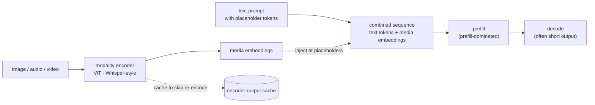

# Chapter 20 — Multimodal and encoder-prefill serving

## TL;DR

When the input is an image, audio, or video instead of text, a new stage appears in front of the language model: a **modality encoder** (a vision transformer for images, an audio encoder for speech) that turns the media into embeddings, which are then injected into the token sequence at **placeholder positions** (Ch.03's special tokens, now standing in for media) and prefilled alongside the text. The defining consequence: multimodal serving is **prefill-dominated**. One image is worth hundreds to thousands of "tokens"; a minute of audio, more; a video, far more — while the output (a caption, an answer, a transcript segment) is often short. So the prefill/decode asymmetry you've tracked since Ch.01 tilts hardest here, toward prefill and toward the encoder. This chapter is what changes when the input isn't text: the encoder stage, media-embedding injection, encoder-output caching (the media analog of prefix caching), and the memory a thousand image-tokens put on the KV cache — the fastest-growing serving workload, and directly the audio surface you care about.

---

## Why this matters

Multimodal is where the cost model you built gets re-weighted. A text chatbot is decode-heavy; an image-QA or speech model is prefill-heavy, and the expensive new component — the encoder — sits outside everything Ch.02–14 optimized. If you size a multimodal deployment with text-serving intuitions (decode throughput, short prompts), you will mis-provision by an order of magnitude: the KV cache for a high-resolution image or a long audio clip dwarfs a text prompt, the encoder competes with the LLM for the GPU, and time-to-first-token is dominated by encoding and a massive prefill. Understanding the encoder-prefill regime is understanding the cost of the workloads growing fastest right now — and, for audio specifically, the shape of serving a speech model in production.

---

## The concept

### An encoder in front of the language model

A multimodal request is text plus media, and the media takes a detour the text doesn't:

1. The **modality encoder** (a ViT for images, a Whisper-style encoder for audio, similar for video) turns the raw media into a sequence of embeddings.
2. Those embeddings are **injected into the token sequence** at placeholder positions — where the prompt said `<image>` or `<audio>`, N media embeddings take its place.
3. The language model **prefills** over the combined sequence (text tokens + media embeddings) and then **decodes** its answer as usual.



So everything from Ch.01–14 still runs — but with an encoder bolted on the front and a chunk of the "prompt" being embeddings the tokenizer never produced. Both engines model this explicitly:

```python
# SGLang — a multimodal request carries media alongside text; each modality has its own encoder.
# sglang/.../multimodal/processors/base_processor.py @ 52c6e27

audios: Optional[list[...]] = ...     # L68 (BaseMultiModalProcessorOutput) audio inputs, Modality.AUDIO — the speech surface
image_token: Optional[...] = None     # L86 (MultimodalSpecialTokens) the PLACEHOLDER token media embeddings replace (Ch.03)
# each (Modality.IMAGE / AUDIO / VIDEO, data) → its encoder → embeddings injected at the placeholder positions
```

The `image_token` (and its audio/video siblings) is the same special-token contract from Ch.03, now marking *where* media goes — the chat template emits the placeholder, and the engine expands it into the encoder's output embeddings.

### The cost profile tilts hard to prefill

Here is the defining fact. Media is *token-expensive*: a single image is commonly hundreds to a couple thousand vision tokens (a function of resolution and patch size); a minute of audio is on the order of thousands of tokens; video multiplies again. Meanwhile the *output* is frequently short — a caption, a yes/no, a transcript chunk. So a multimodal request is a huge **prefill** followed by a small **decode** — the exact inverse of a chat completion's profile, and the sharpest form of Ch.01's prefill/decode asymmetry. This flips your optimization priorities: the prefill wall (Ch.14) and the encoder are the cost, not decode throughput (Ch.05). Chunked prefill (Ch.11) and prefill/decode disaggregation (Ch.11) matter *more* here than anywhere else in the course.

### The encoder stage

The encoder is a separate model with its own compute and memory, running before the LLM ever sees the request. That has consequences the text path doesn't:

- It **competes with the LLM for the GPU** — encoder compute and LLM compute must be scheduled against each other, and a naive setup lets one starve the other.
- It is often **compute-heavy and batchable** on its own schedule, which is why engines run it with dedicated optimizations (SGLang uses CUDA-graph runners for its vision encoders, e.g. `vit_cuda_graph_runner.py`).
- It adds a **latency stage** before prefill even starts, so TTFT for multimodal = encode time + prefill time + queue — a longer critical path than text.

Treating the encoder as a first-class serving stage — with its own batching and scheduling — rather than an afterthought is what separates a fast multimodal stack from a slow one.

### Encoder-output caching (the media analog of prefix caching)

Re-encoding the same media is pure waste, exactly as re-prefilling the same prefix was (Ch.12). If the same image or audio clip appears across requests (a document image queried repeatedly, a reference clip, a multi-turn conversation about one picture), its encoder output can be **cached and reused** instead of recomputed. vLLM's `EncoderCacheManager` (`v1/core/encoder_cache_manager.py`) does exactly this — caching multimodal encoder outputs (e.g. image embeddings) to avoid recomputing them — and SGLang's `MultiModalStaticCache` (`mem_cache/multimodal_cache.py`) is its server-level multimodal-embedding cache. It's the same idea as prefix caching, one stage earlier in the pipeline — and because encoding is expensive, the win is large for any workload that reuses media. (Don't confuse this with vLLM's `multimodal/cache.py`, which caches *preprocessed features* — the encoder's *input* — one stage earlier still.)

### Memory: a thousand image-tokens hit the KV cache

The media embeddings don't just cost encoder compute — in the dominant **in-sequence injection** design, once prefilled they occupy the **KV cache** like any other tokens (Ch.04): a 1,500-token image contributes 1,500 tokens of KV per request; a long audio clip, thousands. (The **cross-attention** family — Flamingo, Llama-3.2-Vision — is the exception: it attends to media features through dedicated cross-attention layers, so those features live in a *separate* cross-attention KV, not the decoder's self-attention KV. Most current open VLMs — LLaVA, Qwen-VL, InternVL, Pixtral — use in-sequence injection, which is why this course centers it.) So the Ch.04 formula, already the binding constraint at long context (Ch.14), is stressed hard by multimodal: a handful of high-resolution images or long audio clips can fill the KV pool as fast as a long-context text workload. Everything that shrinks the KV cache — GQA (Ch.04), FP8 KV (Ch.09), paging (Ch.06) — is load-bearing for multimodal capacity.

### Batching and disaggregation for mixed workloads

Real traffic mixes text-only and multimodal requests, and the two have opposite profiles (decode-heavy vs. prefill-heavy). Batching them naively lets a giant image prefill stall text decodes (the Ch.11 interference, amplified). The tools are the ones you already have, pointed at a harder case: **chunked prefill** (Ch.11) to keep decodes flowing past a huge media prefill, and **prefill/decode disaggregation** (Ch.11) — which is especially natural here, since the encoder + prefill can live on separate workers from the decode. The prefill-heavy nature of multimodal is exactly why disaggregation, an option for text, becomes close to a necessity at scale.

### Audio serving, specifically

Audio is a first-class modality (SGLang's `Modality.AUDIO`, the `audios` input, `load_audio`), and it sharpens every point above. An audio encoder turns a waveform into a sequence of embeddings whose length grows with duration — so **long audio is a large prefill**, and streaming audio input adds a real-time dimension (encode as chunks arrive) that text doesn't have. Serving a speech model well means treating the audio encoder as the dominant cost stage, sizing the KV pool for long audio-token sequences, caching encoder output for repeated clips, and disaggregating the encode+prefill from the decode. It is the encoder-prefill regime in its most extreme form.

### Two engines, one shape

Verified in both. **Agreement (load-bearing):** for the **in-sequence injection** model families (LLaVA / Qwen-VL / InternVL / Pixtral and most current VLMs), both process multimodal inputs by running a modality-specific encoder, injecting the resulting embeddings at placeholder tokens (the Ch.03 special-token contract — SGLang's `image_token`/`audios`, vLLM's placeholder expansion), prefilling over the combined text+media sequence, and caching encoder outputs to avoid re-encoding (vLLM's `EncoderCacheManager`; SGLang's `MultiModalStaticCache`). Both treat multimodal as an encoder-prefill front end on the same loop from Ch.02. **Divergence (modalities, injection style & encoder optimization, will rot):** which modalities and model families each supports, and how the encoders are optimized (CUDA-graph runners, batching, quantization of the encoder) differ and evolve fast — as does the **cross-attention** alternative (Llama-3.2-Vision, present in SGLang's `models/mllama.py` with `MllamaTextCrossAttention`), where media features are attended via dedicated layers rather than injected in-sequence, and so do *not* occupy the self-attention KV. The encoder-then-inject-then-prefill *shape*, and the prefill-dominated cost profile, are the durable concepts for the in-sequence family; the modality zoo, the cross-attention exception, and encoder tricks are what change.

---

## Real-system notes

- **SGLang** — `python/sglang/srt/multimodal/` @ `52c6e27`: `processors/base_processor.py` (`audios` L68, `image_token` L86, `Modality.IMAGE/AUDIO/VIDEO`), plus CUDA-graph encoder runners (`vit_cuda_graph_runner.py`, `internvl_vit_cuda_graph_runner.py`) and audio/video helpers (`audio_from_video.py`, `evs/`); encoder-output/embedding caching in `mem_cache/multimodal_cache.py` (`MultiModalStaticCache`). First-class audio and video support.
- **vLLM** — `vllm/multimodal/` @ `ae098ab`: `registry.py`, `processing/`, `inputs.py` (encode + placeholder expansion — the `<image>`-token → N embeddings mapping), plus **`v1/core/encoder_cache_manager.py`** (`EncoderCacheManager`) which caches encoder outputs to avoid re-encoding. (Note: `multimodal/cache.py` is a *processor-output* / preprocessed-feature cache, one stage earlier — not the encoder-output cache.) Ch.03's renderer builds the mixed text+embeds prompt.
- **External** — the architecture: LLaVA-style vision-language models (Liu et al., 2023) established the encoder→projector→LLM pattern; Whisper (Radford et al., 2022) is the canonical audio encoder; Qwen-VL / Qwen-Audio and successors are common multimodal serving targets. Ask your agent for the current best encoder-serving recipe and the token-count-per-image/second-of-audio for your specific model.

---

## Common failure cases

*These failures are durable; their fixes evolve fastest — each names the pattern and leaves current specifics to you and your AI partner.*

- **Sizing multimodal with text intuitions.** Provisioning for decode throughput and short prompts under-counts the encoder cost and the media-token KV. *Fix: budget for prefill-dominated load — encoder compute + huge prefill + media-token KV (Ch.04, this chapter).*
- **Treating the encoder as an afterthought.** An unscheduled encoder starves the LLM or vice versa. *Fix: make the encoder a first-class serving stage with its own batching/optimization (this chapter).*
- **Re-encoding repeated media.** Encoding the same image/clip every request wastes the most expensive new stage. *Fix: cache encoder outputs (vLLM's `EncoderCacheManager`, SGLang's `MultiModalStaticCache`) — the media analog of prefix caching (Ch.12).*
- **Media prefill stalling text decodes.** A giant image/audio prefill freezes co-batched text requests. *Fix: chunked prefill and prefill/decode disaggregation, which multimodal makes near-mandatory (Ch.11).*
- **Ignoring media-token KV pressure.** A few high-res images or long audio clips fill the KV pool unexpectedly. *Fix: apply GQA/FP8-KV/paging and size the pool for media-token counts (Ch.04, Ch.06, Ch.09).*

---

## Pair with your agent

- *"For my multimodal model, tell me how many tokens one image (at my resolution) and one minute of audio become, then compute the KV cache each consumes (Ch.04) and how many fit per GPU."*
- *"Trace a multimodal request end-to-end: encoder → placeholder injection → prefill → decode. Show me where TTFT time goes (encode vs. prefill vs. queue) and what dominates."*
- *"Open `references/sglang/.../multimodal/processors/base_processor.py` (`audios`, `image_token`) and `references/vllm/vllm/v1/core/encoder_cache_manager.py` (`EncoderCacheManager`). Show me the modality inputs and the encoder-output cache — and note `vllm/multimodal/cache.py` is a *processor* cache, not the encoder-output one — then relate the placeholder to Ch.03's special tokens."*
- *"Design an audio-serving deployment: audio encoder as the dominant stage, KV sizing for long audio-token sequences, encoder-output caching, and encode/prefill-vs-decode disaggregation. What's the cost profile vs. a text model?"*
- *"Show me a mixed text+image workload where the image prefill stalls text decodes, then fix it with chunked prefill and disaggregation (Ch.11)."*

---

## What's next

You've now served the input modalities the field is racing to support. The final content chapter looks over the horizon: Ch.21 is **frontier serving** — the techniques at the edge of production in 2026: disaggregated prefill/decode at fleet scale, KV-cache offloading and tiering, MoE-serving economics, and the fast-moving optimizations that aren't yet settled. It's deliberately the thinnest chapter, because the frontier is exactly what your AI partner (and the reference systems' `main` branches) will have fresher answers on than any written page.
