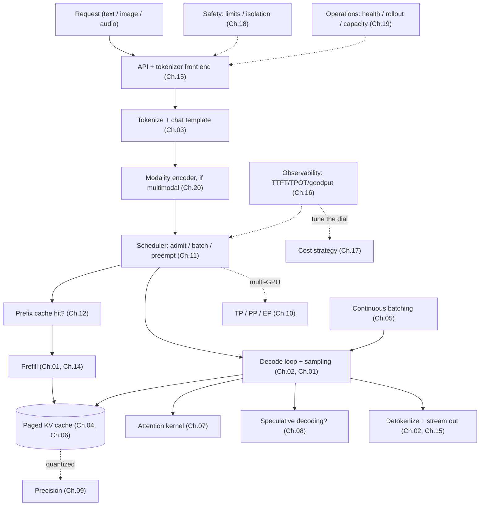

# Chapter 22 — Designing your own serving stack

You have read twenty-one chapters. This one is not another. It is a **design canvas** — a way to translate everything from Ch.01 through Ch.21 into the specific shape of *your* serving stack. Lead with intent, not architecture: the model, the traffic, the latency SLO, the budget, the scale. Once those are crisp, the architecture is mostly a matter of deciding which of the earlier chapters' levers are load-bearing for you and which can wait.

Every deployment tunes the same engine differently. A single-stream coding assistant and a batch document-processor and a real-time speech service run the *same* forward pass (Ch.01) through the *same* loop (Ch.02), but almost nothing else about their configs matches — because their traffic, their SLOs, and their budgets differ. The course gave you the levers; this chapter helps you decide which ones your workload actually needs. It deliberately stops naming line numbers and starts asking questions.

---

## The whole stack in one frame

Read it as a checklist of *what could be load-bearing*, not a blueprint of *what must be present*. Your first deployment uses maybe half these boxes at their defaults; the rest are levers you reach for when your SLO or budget forces you to. If you can name every box and say what it costs you, you're ready to design.

---

## Intent first — the serving canvas

Before any architecture decision, answer these. None is about *how*; all are about *what* and *why*.

- **Model.** Which model, at what quality bar? Is it fixed, or yours to choose? (The single highest-leverage cost decision — Ch.17.)
- **Traffic.** Request rate and burstiness. Prompt- and output-length distribution. And crucially: **how much prefix reuse** — shared system prompts, multi-turn chat, agent loops (high reuse), or unique one-off prompts (none)? This decides whether prefix caching (Ch.12) is your biggest win or irrelevant.
- **Latency SLO.** Interactive (tight TTFT *and* TPOT) or batch/offline (latency doesn't matter, throughput does)? This sets the entire throughput-vs-latency operating point (Ch.05, Ch.17).
- **Budget.** Cost per token, per request, or a GPU budget. If you can't state it, the bill will state it for you.
- **Scale.** One GPU, one node, or a fleet? Single-tenant or multi-tenant? (Ch.10, Ch.15.)
- **Modality.** Text only, or image / audio / video? (Ch.20 — a different cost profile entirely.)
- **Quality tolerance.** Can you quantize (Ch.09)? How much degradation is acceptable, and on which tasks?
- **Worst case.** What happens when the service is down, slow, or wrong? This sets your ops rigor (Ch.19) and safety controls (Ch.18).

Eight questions, ten minutes. If any is vague, the decisions that follow will be vague too. If they're crisp, the architecture mostly composes itself.

---

## The architecture canvas — walk this with your agent

Once intent is locked, walk these with your agent. Each points at the chapters that own it; the goal is to know which decisions you've made and which you've deferred.

- **The loop and its contract (Ch.01–03).** Model, tokenizer, chat template pinned as one unit; sampling params and stop conditions set. Non-negotiable foundation.
- **KV cache, batching, paging (Ch.04–06).** The KV budget from the formula; continuous batching on; paged memory. This is the engine's core efficiency — almost always load-bearing.
- **Kernels and speculative decoding (Ch.07–08).** A paged-aware FlashAttention kernel (default). Speculative decoding *only* if you're latency-sensitive and low-batch.
- **Precision and parallelism (Ch.09–10).** Quantize to the lowest bit-width that holds quality on your eval. TP within a node if the model needs it or latency demands it; PP across nodes only if it won't fit.
- **Scheduler and prefix caching (Ch.11–12).** Admission and preemption policy; chunked prefill; disaggregation if prefill-heavy. Prefix caching on if your traffic reuses prefixes — often the biggest single win.
- **Constrained decoding and long context (Ch.13–14).** Grammar-constrained output if you serve tool calls / structured data. RoPE scaling + the long-context lever stack if prompts are long.
- **Backend, observability, cost (Ch.15–17).** The process split and OpenAI API; the metric dashboard (TTFT/TPOT/goodput); the dial tuned to your SLO; routing/cascades if traffic difficulty varies.
- **Safety and operations (Ch.18–19).** Request limits and tenant isolation; health checks, a rollback path, a capacity model, and a runbook — on day one.
- **Multimodal and frontier (Ch.20–21).** Encoder serving if you have media; the frontier levers (disaggregation, offload, MoE) only when the fundamentals aren't enough.

You don't need every answer now. You need to know which you've decided, which you've deferred, and which you haven't considered.

---

## Choose an archetype

Five archetypes recur. Pick the closest; the load-bearing chapters are listed alongside.

- **Interactive assistant / chatbot** — tight latency, high prefix reuse (system prompts, chat history), decode-sensitive. Load-bearing: continuous batching (Ch.05), prefix caching (Ch.12), speculative decoding (Ch.08), the dial tuned to TTFT/TPOT (Ch.17), observability (Ch.16). This is the low-batch, latency-first regime.
- **Offline / batch processing** — throughput-maximizing, latency-insensitive (summarize a corpus, label a dataset). Load-bearing: maximal batching (Ch.05), aggressive quantization (Ch.09), cost-per-token (Ch.17); speculative decoding *off* (no idle compute to spend). The throughput-first regime.
- **Agent / tool backend** — many short calls, structured output, heavy shared-prefix reuse (a fixed system prompt + tool schema per call). Load-bearing: prefix caching (Ch.12), constrained decoding (Ch.13), low TTFT (Ch.17), and the connection to the agent course's harness. Prompt-heavy, structure-heavy.
- **Multimodal / speech service** — prefill- and encoder-dominated (image QA, audio transcription/understanding). Load-bearing: encoder-prefill serving (Ch.20), prefill/decode disaggregation and chunked prefill (Ch.11), KV sizing for media tokens (Ch.04, Ch.09). The prefill-first regime — and the one where the encoder is the cost.
- **Edge / on-prem / single-GPU** — capacity-constrained, often local-first. Load-bearing: quantization to fit (Ch.09), the smallest model that passes the eval (Ch.17), llama.cpp-class runtimes, and a minimal ops surface (Ch.19). The fit-it-at-all regime.

These are lenses, not required builds. Most real systems blend two — an interactive assistant with agent/tool-backend structure, a speech service with batch-processing economics. Pick the closer one and let the second come in as you outgrow the first.

---

## Final thought

The point of this course was never to make you memorize vLLM's or SGLang's source, or to reproduce someone else's serving stack. It was to give you a system map — from one forward pass through the batched, paged, cached, constrained, multi-GPU, observable, safe, operable service that turns that pass into a product. Once you can name the atom, the loop, the cache, the batch, the paging, the kernel, the speculation, the precision, the parallelism, the scheduler, the prefix cache, the constraint, the long-context stack, the backend, the metrics, the cost dial, the safety controls, the runbook, the encoder, and the frontier — you can design your own serving stack with real instincts, and your agent can fill in the current details against your specific model, traffic, and budget.

Go serve a model you actually need to serve, at a cost you can defend. The agent reading this with you is ready when you are.

---

*Twenty-two chapters, one forward pass to a production service. The concepts here age slowly; the SDKs, kernels, prices, and `main` branches age fast — which is exactly why you learned the map here and get the details live. That division of labor — durable skeleton, live agent, your intent — is the whole design.*
